<!-- _class: cover -->
# Pyxelで、プログラミングを遊ぼう！
## 「楽しく作る」をデザインする

<p class="en-title">Let’s Play Programming with Pyxel! — Designing the Fun of Making</p>

<p class="mark"></p>

<p class="who">北尾 崇<span class="rome">Takashi Kitao</span></p>
<p class="ids"><span class="x">@kitao</span><span class="mail">takashi.kitao@gmail.com</span></p>

<p class="chars">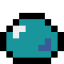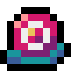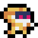</p>


---

<!-- _class: hero -->
# 今日は、Pyxelの話をします
## Today I’d Like to Talk About Pyxel


---

<!-- _class: section ch0 -->
<p class="no ch0n"><span class="ic"><svg viewBox="0 0 24 24" fill="none" stroke="currentColor" stroke-width="1.308" stroke-linecap="round" stroke-linejoin="round"><g transform="rotate(-8 12 12)"><path d="M6.33 2.92h7.88l3.46 3.46v14.22H6.33z"/><path d="M14.02 3.01v3.46h3.46"/><path d="M9.98 11.18a1.92 1.92 0 1 1 2.5 1.83c-.38 .14-.58 .48-.58 .91v.58"/><path d="M11.9 16.95h.01"/></g></svg></span>INTRODUCTION</p>

# 奇妙なアルバイト
## A Strange Job Offer

<p class="scene">
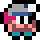

</p>


---

<!-- _class: mock dense ch0 -->
# こんなアルバイト、いかがですか？
## How About a Part-Time Job Like This?

<div class="doc">
<div class="doc-h">アルバイト募集 <span class="en block">PART-TIME POSITION AVAILABLE</span></div>
<table>
<tr><th>業務内容 <span class="en block">Duties</span></th><td>画面を見ながら、レバーを右に倒し続けてください <span class="en block">Watch the screen and keep pushing the lever to the right</span></td></tr>
<tr><th></th><td>図形が表示されたら、ボタンを1回押してください <span class="en block">When a shape appears, press the button once</span></td></tr>
<tr><th></th><td>押し遅れると、最初からやり直しです <span class="en block">If you press too late, you start over from the beginning</span></td></tr>
<tr><th></th><td>その作業を、延々と繰り返してください <span class="en block">Repeat that, over and over, without end</span></td></tr>
<tr><th>勤務時間 <span class="en block">Hours</span></th><td>30時間 <span class="en block">30 hours</span></td></tr>
<tr class="pay"><th>報 酬 <span class="en block">Pay</span></th><td><div class="payrow"><div class="amt"><b>4,900円</b><span class="en block">4,900 yen</span></div></div></td></tr>
</table>
</div>


---

<!-- _class: mock dense ch0 f2 -->
# こんなアルバイト、いかがですか？
## How About a Part-Time Job Like This?

<div class="doc">
<div class="doc-h">アルバイト募集 <span class="en block">PART-TIME POSITION AVAILABLE</span></div>
<table>
<tr><th>業務内容 <span class="en block">Duties</span></th><td>画面を見ながら、レバーを右に倒し続けてください <span class="en block">Watch the screen and keep pushing the lever to the right</span></td></tr>
<tr><th></th><td>図形が表示されたら、ボタンを1回押してください <span class="en block">When a shape appears, press the button once</span></td></tr>
<tr><th></th><td>押し遅れると、最初からやり直しです <span class="en block">If you press too late, you start over from the beginning</span></td></tr>
<tr><th></th><td>その作業を、延々と繰り返してください <span class="en block">Repeat that, over and over, without end</span></td></tr>
<tr><th>勤務時間 <span class="en block">Hours</span></th><td>30時間 <span class="en block">30 hours</span></td></tr>
<tr class="pay"><th>報 酬 <span class="en block">Pay</span></th><td><div class="payrow"><div class="amt"><b>4,900円</b><span class="en block">4,900 yen</span></div><div class="note"><span class="ar">←</span><span class="tx">受け取る額ではなく、支払う額<span class="en block">Not what you earn — what you pay</span></span></div></div></td></tr>
</table>
</div>


---

<!-- _class: ch0 -->
# そのアルバイト、体験済みかも？
## Have You Already Worked This Job?

<div class="pair fit">
<figure>
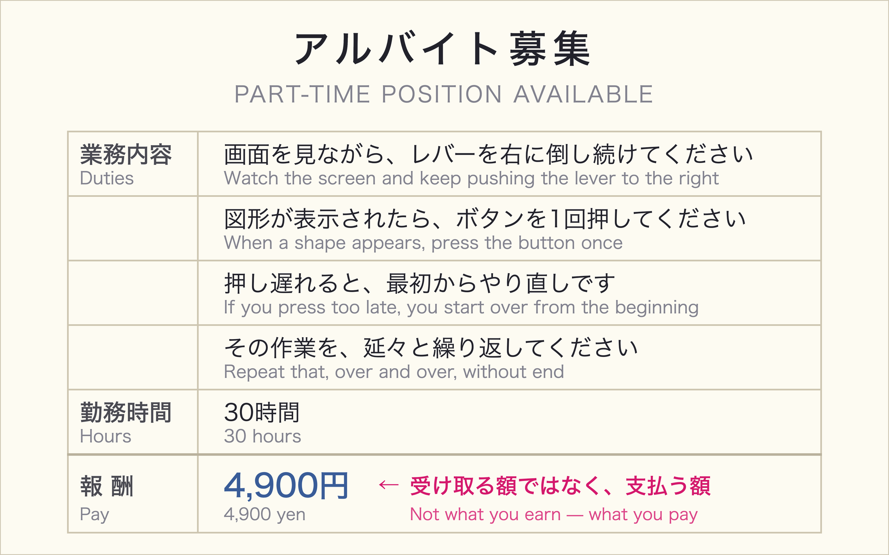
</figure>
<figure>
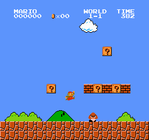
<p class="credit">Super Mario Bros. &copy; 1985 Nintendo</p>
</figure>
</div>

<p class="msg">「作業」と「遊び」は紙一重。違いは、楽しくする工夫があるかどうか<span class="en block">Work and play are a hair apart. The difference is whether someone designed the fun</span></p>


---

<!-- _class: dense ch0 f2 -->
# ゲームデザインとは
## What Is Game Design?

<p class="lead">プレイヤーに「楽しい」「面白い」と感じさせる仕組み<span class="en block">The workings that make players find it fun and interesting</span></p>

<div class="gd">
<div class="gd-goal"><span class="lb">目指す体験：<span class="en">The experience to aim for</span></span>
<div class="b b-free"><span class="ic"><svg viewBox="0 0 64 64" fill="none" stroke="currentColor" stroke-width="3.5" stroke-linecap="round" stroke-linejoin="round"><path d="M32 8 39.84 23.8l17.43 2.5-12.63 12.31 3.05 17.43L32 47.76l-15.68 8.28 3.05-17.43L6.73 26.3l17.43-2.5L32 8z"/></svg></span><span class="tx">やりたいことができる <span class="en block">You can do what you want</span></span></div>
<div class="b b-reward"><span class="ic"><svg viewBox="0 0 64 64" fill="none" stroke="currentColor" stroke-width="3.5" stroke-linecap="round" stroke-linejoin="round"><path d="M19.09 6.72h25.83v12.91c0 10.57-5.52 17.61-12.91 17.61s-12.91-7.04-12.91-17.61V6.72z"/>
  <path d="M19.09 11.42H8.52v5.87c0 8.22 5.28 12.91 12.33 12.91"/>
  <path d="M44.91 11.42h10.57v5.87c0 8.22-5.28 12.91-12.33 12.91"/>
  <path d="M32 37.24v10.57"/>
  <path d="M22.61 57.2h18.78"/>
  <path d="M26.13 47.81h11.74"/></svg></span><span class="tx">達成感が得られる <span class="en block">You get a sense of achievement</span></span></div>
</div>
<div class="gd-means"><span class="lb">実現手段：<span class="en">How it is done</span></span>
<div class="g"><div class="gh"><span class="ic"><svg viewBox="0 0 64 64" fill="none" stroke="currentColor" stroke-width="3.5" stroke-linecap="round" stroke-linejoin="round"><circle cx="32" cy="32" r="25.13"/>
  <path d="M6.87 32h50.27"/>
  <path d="M32 6.87c8.38 7.33 12.57 15.71 12.57 25.13S40.38 49.8 32 57.13"/>
  <path d="M32 6.87c-8.38 7.33-12.57 15.71-12.57 25.13s4.19 17.8 12.57 25.13"/>
  <path d="M12.1 19.43h39.79M12.1 44.57h39.79"/></svg></span><span class="tx">世界の構築 <span class="en block">Building a world</span></span></div><div class="gi"><span>計算 <span class="en block">Math</span></span> <span>ルール <span class="en block">Rules</span></span> <span>物語 <span class="en block">Story</span></span></div></div>
<div class="g"><div class="gh"><span class="ic"><svg viewBox="0 0 64 64" fill="none" stroke="currentColor" stroke-width="3.5" stroke-linecap="round" stroke-linejoin="round"><path d="M13.8 7.73H34.02A6.07 6.07 0 0 1 40.09 13.8V25.93A6.07 6.07 0 0 1 34.02 32H17.84L7.73 40.09V13.8A6.07 6.07 0 0 1 13.8 7.73Z"/>
  <path class="knock" d="M29.98 23.91H50.2A6.07 6.07 0 0 1 56.27 29.98V56.27L46.16 48.18H29.98A6.07 6.07 0 0 1 23.91 42.11V29.98A6.07 6.07 0 0 1 29.98 23.91Z"/></svg></span><span class="tx">フィードバック <span class="en block">Feedback</span></span></div><div class="gi"><span>映像 <span class="en block">Visuals</span></span> <span>音 <span class="en block">Sound</span></span> <span>言葉 <span class="en block">Words</span></span></div></div>
<div class="g"><div class="gh"><span class="ic"><svg viewBox="0 0 64 64" fill="none" stroke="currentColor" stroke-width="3.5" stroke-linecap="round" stroke-linejoin="round"><path d="M50.95 20.42A23.16 23.16 0 0 0 12 17.26"/>
  <path d="M12 17.26V6.73M12 17.26h10.53"/>
  <path d="M13.05 43.58a23.16 23.16 0 0 0 38.95 3.16"/>
  <path d="M52 46.74v10.53M52 46.74H41.48"/></svg></span><span class="tx">試行錯誤の後押し <span class="en block">Encouraging trial and error</span></span></div><div class="gi"><span>目標 <span class="en block">Objectives</span></span> <span>ヒント <span class="en block">Hints</span></span> <span>補正 <span class="en block">Assists</span></span></div></div>
</div>
</div>


---

<!-- _class: ch0 -->
# 達成感は錯覚でも良い
## An Illusion of Achievement Is Fine

<div class="pair fit">
<figure>
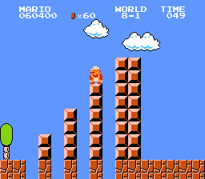
<figcaption>8-1</figcaption>
</figure>
<figure>
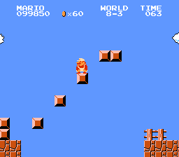
<figcaption>8-3</figcaption>
</figure>
<p class="credit">Super Mario Bros. &copy; 1985 Nintendo</p>
</div>

<p class="msg">難易度は同じ。見え方が違うだけ<span class="en block">The difficulty is the same. Only the look differs</span></p>


---

<!-- _class: dense ch0 f2 -->
# 自己紹介
## About Me

<p class="who">北尾 崇<span class="rd">きたお たかし</span><span class="en">Takashi Kitao</span></p>

<div class="bio">
<div class="r"><div class="k">過去<span class="en block">Past</span></div><div class="v">元ゲーム開発者<span class="en block">Former game developer</span><span class="cr"><b>『METAL GEAR SOLID』</b>企画 / ムービー制作<span class="en">Planner / Cutscene Production</span></span><span class="cr"><b>『ZONE OF THE ENDERS』シリーズ</b>メインプログラマ / ゲームデザインユニットディレクター<span class="en">Lead Programmer / Game Design Unit Director</span></span></div></div>
<div class="r"><div class="k">現在<span class="en block">Now</span></div><div class="v">ソニー株式会社　技術開発研究所　XRシステム技術開発部　統括部長<span class="en block">General Manager, XR Systems Technology Development Dept., Technology Development Laboratories, Sony</span><span class="ymean">XR（拡張現実・仮想現実・複合現実）とAIの研究開発<span class="en">R&amp;D in XR (AR/VR/MR) and AI</span></span></div></div>
<div class="r"><div class="k">個人開発<span class="en block">Personal project</span></div><div class="v">2018年からレトロゲームエンジンPyxelを開発<span class="en block">Developing the retro game engine Pyxel since 2018</span></div></div>
<div class="r"><div class="k">著書<span class="en block">Book</span></div><div class="v">『ゲームで学ぶPython！ Pyxelではじめるレトロゲームプログラミング』<span class="en block">Learn Python Through Games: Retro Game Programming with Pyxel</span><span class="ymean">2025年1月 技術評論社刊<span class="en">January 2025, published by Gijutsu-Hyoron Co., Ltd.</span></span></div>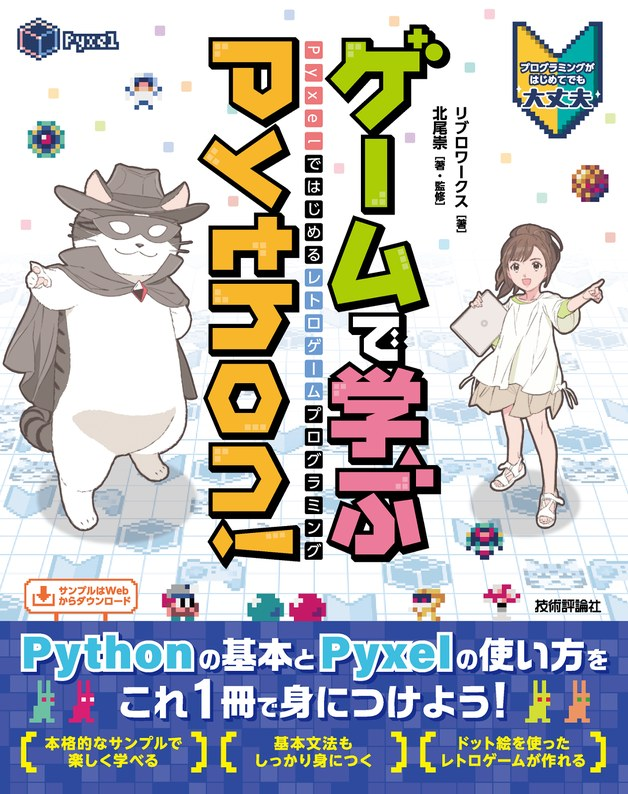</div>
</div>


---

<!-- _class: dense ch0 -->
# 自己紹介
## About Me

<p class="who">北尾 崇<span class="rd">きたお たかし</span><span class="en">Takashi Kitao</span></p>

<div class="bio">
<div class="r"><div class="k">過去<span class="en block">Past</span></div><div class="v">元ゲーム開発者<span class="en block">Former game developer</span><span class="cr"><b>『METAL GEAR SOLID』</b>企画 / ムービー制作<span class="en">Planner / Cutscene Production</span></span><span class="cr"><b>『ZONE OF THE ENDERS』シリーズ</b>メインプログラマ / ゲームデザインユニットディレクター<span class="en">Lead Programmer / Game Design Unit Director</span></span></div></div>
<div class="r"><div class="k">現在<span class="en block">Now</span></div><div class="v">ソニー株式会社　技術開発研究所　XRシステム技術開発部　統括部長<span class="en block">General Manager, XR Systems Technology Development Dept., Technology Development Laboratories, Sony</span><span class="ymean">XR（拡張現実・仮想現実・複合現実）とAIの研究開発<span class="en">R&amp;D in XR (AR/VR/MR) and AI</span></span></div></div>
<div class="r hl"><div class="k">個人開発<span class="en block">Personal project</span></div><div class="v">2018年からレトロゲームエンジンPyxelを開発<span class="en block">Developing the retro game engine Pyxel since 2018</span></div></div>
<div class="r"><div class="k">著書<span class="en block">Book</span></div><div class="v">『ゲームで学ぶPython！ Pyxelではじめるレトロゲームプログラミング』<span class="en block">Learn Python Through Games: Retro Game Programming with Pyxel</span><span class="ymean">2025年1月 技術評論社刊<span class="en">January 2025, published by Gijutsu-Hyoron Co., Ltd.</span></span></div></div>
</div>


---

<!-- _class: two-up ch0 low f2 -->
# レトロゲームエンジンPyxel（ピクセル）
## Pyxel (/ˈpɪksəl/), a Retro Game Engine

<p class="lead">レトロゲーム風のゲームを簡単に作るための、Pythonモジュール＆ツール<span class="en block">A Python module and tools for easily making retro-style games</span></p>

<div class="bio">
<div class="r"><div class="k">コンセプト<span class="en block">Concept</span></div><div class="v">気軽に楽しくプログラミング<span class="en block">Easy and fun programming</span></div></div>
<div class="r"><div class="k">動作環境<span class="en block">Platforms</span></div><div class="v">Windows・Mac・Linux・Webブラウザ<span class="en block">Windows, Mac, Linux, and web browsers</span><span class="ymean">Chrome OS、Raspberry Pi、中華ゲーム機でも動作<span class="en block">Also runs on Chrome OS, Raspberry Pi, and Chinese handhelds</span></span></div></div>
<div class="r"><div class="k">同梱ツール<span class="en block">Bundled tools</span></div><div class="v">イメージエディタ／サウンドエディタ<span class="en block">Image editor and sound editor</span></div></div>
<div class="r"><div class="k">ライセンス<span class="en block">License</span></div><div class="v">MITライセンス<span class="en block">MIT License</span><span class="ymean">商用利用も含め、無料で自由に使える<span class="en block">Free to use, including commercially</span></span></div></div>
<div class="r"><div class="k">採用実績<span class="en block">Adoption</span></div><div class="v">世界中の教育機関やプログラミング教室で採用<span class="en block">Schools, coding classes, and more, worldwide</span><span class="ymean">慶應義塾大学、大阪大学、Tentoなど<span class="en block">Keio University, Osaka University, Tento, and more</span></span></div></div>
<div class="r"><div class="k">公式サイト<span class="en block">Website</span></div><div class="v"><a target="_blank" rel="noopener" href="https://github.com/kitao/pyxel">https://github.com/kitao/pyxel</a><span class="en block">Documentation, examples, and source</span></div></div>
</div>

<p>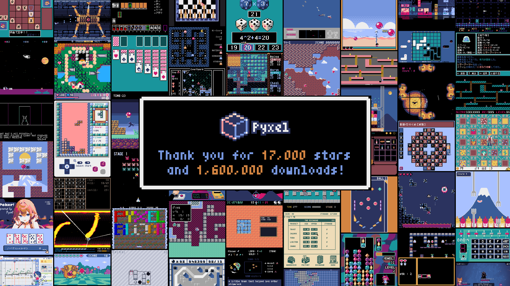</p>


---

<!-- _class: ch0 -->
# 現代版「レトロゲーム」
## Retro Games Made Today

<div class="pair gap-wide">
<figure>
<video src="assets/works/cursed_caverns.mp4" poster="assets/works/cursed_caverns_poster.png" controls playsinline></video>
<figcaption>Pyxel書籍付属サンプル『Cursed Caverns』<span class="en block">Cursed Caverns, a sample game from the Pyxel book</span></figcaption>
<p class="credit">Music &copy; Maki Kirioka</p>
</figure>
<figure>
<video src="assets/works/dungeon_antiqua.mp4" poster="assets/works/dungeon_antiqua_poster.png" controls playsinline></video>
<figcaption>Pyxel製の商用タイトル『Dungeon Antiqua』<span class="en block">Dungeon Antiqua, a commercial title made with Pyxel</span></figcaption>
<p class="credit">&copy; Shiromofu Factory</p>
</figure>
</div>


---

<!-- _class: ch0 f2 -->
# Pyxelで、プログラミングを遊ぼう！<span class="t2">—「楽しく作る」をデザインする</span>
## Let’s Play Programming with Pyxel! — Designing the Fun of Making

<p class="agenda-h">本日は、Pyxelがどのようにプログラミングを「遊び」に変えているのか、<br>その仕組みや考え方、そこに込めた想いについてお話しします<span class="en block">How Pyxel turns programming into play — the mechanisms, the thinking, and the wish behind them</span></p>

<div class="agenda">
<div class="a c1"><span class="ic"><svg viewBox="0 0 24 24" fill="none" stroke="currentColor" stroke-width="1.308" stroke-linecap="round" stroke-linejoin="round"><path d="M12 6.65a4.79 4.79 0 0 0-2.85 8.66c.41 .31 .61 .76 .61 1.27v.56h4.48v-.56c0-.51 .2-.97 .61-1.27A4.79 4.79 0 0 0 12 6.65z"/><path d="M10.06 19.08h3.87M10.68 21.32h2.65"/><path d="M12 4.61L12 2.68M16.79 6.65L18.22 5.22M18.83 11.44L20.76 11.44M5.17 11.44L3.24 11.44M7.21 6.65L5.78 5.22"/></svg></span><b>CHAPTER 1</b><div class="w">アイデアを形にできると、うれしい <span class="en block">Bringing Your Ideas to Life Feels Great</span></div></div>
<div class="a c2"><span class="ic"><svg viewBox="0 0 24 24" fill="none" stroke="currentColor" stroke-width="1.308" stroke-linecap="round" stroke-linejoin="round"><circle cx="8.61" cy="7.39" r="3.28"/><circle cx="16.56" cy="8.45" r="2.54"/><path d="M2.68 19.89c0-3.28 2.65-5.62 5.93-5.62s5.93 2.33 5.93 5.62"/><path d="M16.56 14.49c2.76 0 4.77 2.23 4.77 5.4"/></svg></span><b>CHAPTER 2</b><div class="w">みんなと作るのって、面白い <span class="en block">Making Things Together Is Fun</span></div></div>
<div class="a c3"><span class="ic"><svg viewBox="0 0 24 24" fill="none" stroke="currentColor" stroke-width="1.308" stroke-linecap="round" stroke-linejoin="round"><path d="M12.28 2.67c2.27 2.46 3.6 5.68 3.6 9.09 0 2.46-1.23 4.92-3.6 7.01-2.37-2.08-3.6-4.54-3.6-7.01 0-3.41 1.33-6.63 3.6-9.09z"/><circle cx="12.28" cy="9.21" r="1.7"/><path d="M8.78 13.47 6.13 16.31v2.84l2.84-1.61M15.79 13.47l2.65 2.84v2.84l-2.84-1.61"/><path d="M12.28 19.05v2.27"/><path d="M4.9 4.57l.38 1.14 1.14 .38-1.14 .38-.38 1.14-.38-1.14L3.39 6.08l1.14-.38z"/><path d="M19.48 5.33l.28 .85 .85 .28-.85 .28-.28 .85-.28-.85-.85-.28 .85-.28z"/></svg></span><b>CHAPTER 3</b><div class="w">これからのPyxelは、もっと楽しい！ <span class="en block">Pyxel’s Future Is Even More Exciting!</span></div></div>
</div>


---

<!-- _class: section ch1 -->
<p class="no ch1n"><span class="ic"><svg viewBox="0 0 24 24" fill="none" stroke="currentColor" stroke-width="1.308" stroke-linecap="round" stroke-linejoin="round"><path d="M12 6.65a4.79 4.79 0 0 0-2.85 8.66c.41 .31 .61 .76 .61 1.27v.56h4.48v-.56c0-.51 .2-.97 .61-1.27A4.79 4.79 0 0 0 12 6.65z"/><path d="M10.06 19.08h3.87M10.68 21.32h2.65"/><path d="M12 4.61L12 2.68M16.79 6.65L18.22 5.22M18.83 11.44L20.76 11.44M5.17 11.44L3.24 11.44M7.21 6.65L5.78 5.22"/></svg></span>CHAPTER 1</p>

# アイデアを形にできると、うれしい
## Bringing Your Ideas to Life Feels Great

<p class="scene">


</p>


---

<!-- _class: dense ch1 -->
# Pyxelを作った理由
## Why I Made Pyxel

<div class="why">

<div class="c">
<b>自分のために<span class="en">For myself</span></b>
<div class="a">好きなものを作りたかった<span class="en block">I wanted to build something I loved</span></div>
<i class="ar"></i>
<div class="b">やるならやはり好きなゲーム、<br>題材は思春期を過ごしたレトロゲーム<span class="en block">Then it had to be games —<br>the retro ones I grew up with</span></div>
</div>

<div class="c">
<b>息子のために<span class="en">For my son</span></b>
<div class="a">手軽なプログラミング環境が欲しかった<span class="en block">I wanted an easy programming environment</span></div>
<i class="ar"></i>
<div class="b">既存のゲームエンジンは複雑すぎ、<br>レトロゲーム向けのものはLuaが主流だった<span class="en block">The existing engines were too complex,<br>and the retro ones mostly used Lua</span></div>
</div>

<p class="goal">レトロゲームを題材にしたゲームエンジンを自分で作ることにした<span class="en block">I decided to build a retro-game engine of my own</span></p>

</div>


---

<!-- _class: dense ch1 f2 -->
# ゲームエンジンの中でのPyxelの位置づけ
## Where Pyxel Sits Among Game Engines

<div class="map">
<div class="lb t">広く使える言語<span class="ex">（Python等）</span><span class="en">General-purpose language (Python, etc.)</span></div>
<div class="lb b">ゲーム向け言語<span class="ex">（Lua等）</span><span class="en">Game-oriented language (Lua, etc.)</span></div>
<div class="lb l">高機能<span class="q">（複雑さ大）</span><span class="en">Powerful<br>(but complex)</span></div>
<div class="lb r">シンプル<span class="q">（制約大）</span><span class="en">Simple<br>(but limited)</span></div>
<div class="plot">
<i class="axis-x"></i><i class="axis-y"></i>
<span class="gap" style="--x:75%; --y:25%"><b>欲しかったもの</b><span class="en">What I wanted</span></span>
<span class="p" style="--x:9%; --y:67.1%"></span>
<span class="p" style="--x:18%; --y:38%"></span>
<span class="p" style="--x:32%; --y:75.9%"></span>
<span class="p" style="--x:44%; --y:25%"></span>
<span class="p" style="--x:58%; --y:87%">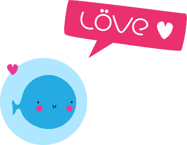</span>
<span class="p" style="--x:85%; --y:62%"></span>
<span class="p" style="--x:89%; --y:90%">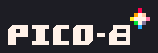</span>
</div>
</div>


---

<!-- _class: dense ch1 -->
# ゲームエンジンの中でのPyxelの位置づけ
## Where Pyxel Sits Among Game Engines

<div class="map">
<div class="lb t">広く使える言語<span class="ex">（Python等）</span><span class="en">General-purpose language (Python, etc.)</span></div>
<div class="lb b">ゲーム向け言語<span class="ex">（Lua等）</span><span class="en">Game-oriented language (Lua, etc.)</span></div>
<div class="lb l">高機能<span class="q">（複雑さ大）</span><span class="en">Powerful<br>(but complex)</span></div>
<div class="lb r">シンプル<span class="q">（制約大）</span><span class="en">Simple<br>(but limited)</span></div>
<div class="plot">
<i class="axis-x"></i><i class="axis-y"></i>
<span class="p me" style="--x:75%; --y:25%"></span>
<span class="p" style="--x:9%; --y:67.1%"></span>
<span class="p" style="--x:18%; --y:38%"></span>
<span class="p" style="--x:32%; --y:75.9%"></span>
<span class="p" style="--x:44%; --y:25%"></span>
<span class="p" style="--x:58%; --y:87%"></span>
<span class="p" style="--x:85%; --y:62%"></span>
<span class="p" style="--x:89%; --y:90%"></span>
</div>
</div>


---

<!-- _class: dense ch1 f2 -->
# 「これならできそう」と思わせる仕掛け
## Making It Feel Doable

<div class="doable">

<div class="steps">
<div class="step"><div class="n">1</div><div class="w">シンプルで学びやすいPythonでプログラムを書ける<span class="en block">Write your program in Python — simple and easy to learn</span><span class="d">Pythonは文法が素直で読みやすく、解説記事や入門書も多い<span class="en block">Plain syntax, readable code, and plenty of tutorials and books</span></span></div></div>
<div class="step"><div class="n">2</div><div class="w">気軽にインストールして、すぐに使い始められる<span class="en block">Install it without fuss and start using it right away</span><span class="d">MITライセンスで無料。どの環境でもpip installだけで導入できる<span class="en block">MIT-licensed and free; pip install alone works on any platform</span></span></div></div>
<div class="step"><div class="n">3</div><div class="w">必要ツールが同梱されており、絵や音が簡単に作れる<span class="en block">The tools come with it, so art and sound are easy to make</span><span class="d">外部ツールの購入・習得が不要。簡単な操作でゲーム素材を作成できる<span class="en block">Nothing to buy or learn; simple controls make your game assets</span></span></div></div>
<div class="step hint"><div class="n">4</div><div class="w">あえて「レトロゲーム」らしい制約を入れている<span class="en block">And it deliberately keeps retro-game-style limits</span></div></div>
</div>

<div class="tools">
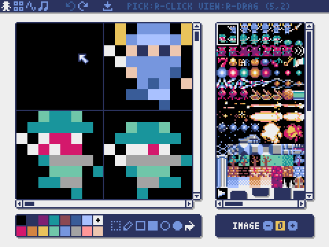
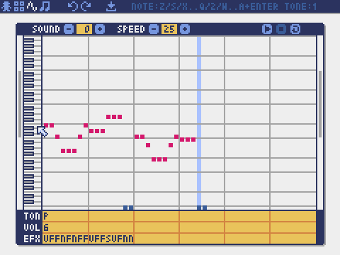
</div>

</div>


---

<!-- _class: ch1 -->
# どちらも「すごい」。では「作れそう」なのは？
## Both Are Impressive. So Which One Feels Doable?

<div class="pair snug">
<figure>

<figcaption>3Dモデリングツール<span class="en block">3D modeling tool</span></figcaption>
<p class="credit">Dragon phantom beast &copy; Keita Okada / Villard Inc.</p>
</figure>
<figure>
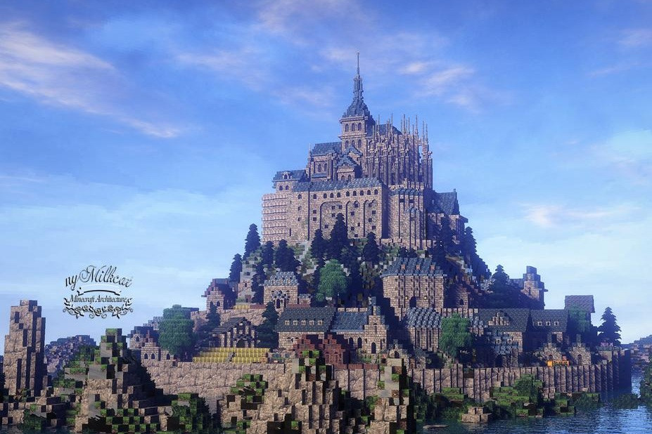
<figcaption>マインクラフト<span class="en block">Minecraft</span></figcaption>
<p class="credit">Mont-Saint-Michel &copy; milk猫 (@milk94698164)</p>
</figure>
</div>


---

<!-- _class: ch1 f2 -->
# どちらも「すごい」。では「作れそう」なのは？
## Both Are Impressive. So Which One Feels Doable?

<div class="pair snug art">
<figure>
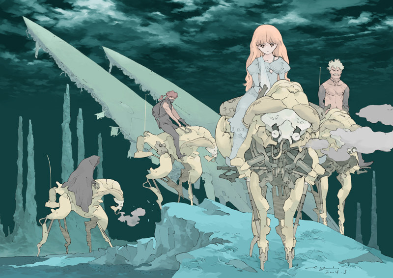
<figcaption>フルカラーのキャラクターイラスト<span class="en block">A full-color character illustration</span></figcaption>
<p class="credit">&copy; Toshio Noguchi</p>
</figure>
<figure>
<div class="pyxart">
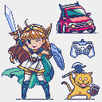
<p class="chars-big"></p>
</div>
<figcaption>ドット絵イラストとキャラクター<span class="en block">A pixel-art illustration and characters</span></figcaption>
<p class="credit">&copy; Toshio Noguchi　&copy; @helpcomputer0</p>
</figure>
</div>


---

<!-- _class: ch1 spec -->
# Pyxelの「レトロゲーム」制約
## Pyxel’s Retro-Game Limits

| | 一般的なゲームエンジン <span class="en block">A typical game engine</span> | Pyxel <span class="en block">A retro game engine</span> |
|---|---|---|
| **色**<span class="en block">Color</span> | フルカラー ── 約1,677万色 <span class="en block">About 16.77 million colors</span> | 16色・半透明なし <span class="en block">16 colors, no translucency</span> |
| **音**<span class="en block">Sound</span> | 同時発音数も音色も実質無制限 <span class="en block">Effectively unlimited voices and timbres</span> | 同時発音数は4音／音色は4種類 <span class="en block">4 voices, 4 waveforms</span> |
| **画像**<span class="en block">Images</span> | サイズも枚数も自由 <span class="en block">Any size, any number</span> | 256×256サイズの画像が3枚 <span class="en block">3 banks of 256×256</span> |
| **描画命令**<span class="en block">Drawing commands</span> | 用途ごとに膨大なAPI <span class="en block">A vast API for every purpose</span> | 基本の描画命令は10種類 <span class="en block">10 basic drawing commands</span> |


---

<!-- _class: image-main ch1 cmds f2 -->
# Pyxelの描画命令
## Pyxel’s Drawing Commands

<div class="cmdfig">
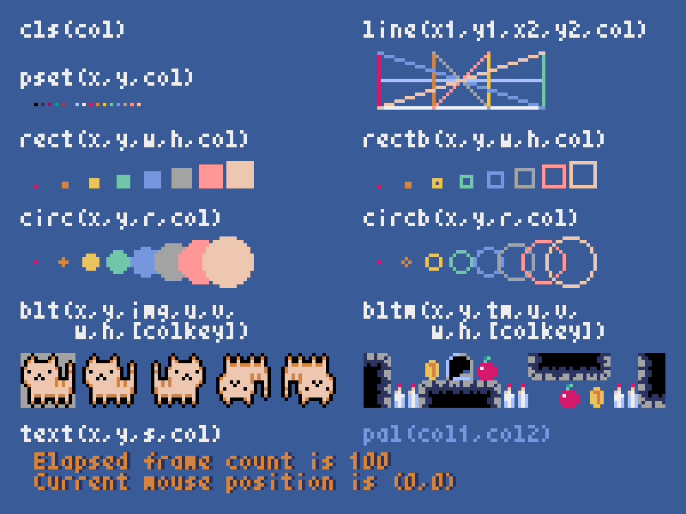
<p class="cmt l" style="--t:5.7%">画面をクリアする<span class="en block">Clear the screen</span></p>
<p class="cmt l" style="--t:15.2%">点を描画する<span class="en block">Draw a pixel</span></p>
<p class="cmt l" style="--t:27.2%">四角形を描画する<span class="en block">Draw a filled rectangle</span></p>
<p class="cmt l" style="--t:42.6%">円を描画する<span class="en block">Draw a filled circle</span></p>
<p class="cmt l" style="--t:62.6%">画像を描画する<span class="en block">Copy from an image bank</span></p>
<p class="cmt l" style="--t:84.5%">文字を描画する<span class="en block">Draw a string</span></p>
<p class="cmt r" style="--t:5.7%">直線を描画する<span class="en block">Draw a line</span></p>
<p class="cmt r" style="--t:27.2%">四角形の枠線を描画する<span class="en block">Draw a rectangle outline</span></p>
<p class="cmt r" style="--t:42.6%">円の枠線を描画する<span class="en block">Draw a circle outline</span></p>
<p class="cmt r" style="--t:62.6%">タイルを並べて描画する<span class="en block">Copy from a tilemap</span></p>
</div>


---

<!-- _class: dense ch1 -->
# ゲームを作ってみよう① 図形を描く
## Making a Game 1 — Drawing Shapes

<p class="lead">描画命令で、キャラクターを描く <span class="en block">Draw the characters with drawing commands</span></p>
<div class="cr" style="--code: 26px">
<div>

```python
import pyxel

pyxel.init(160, 120)

pyxel.cls(1)
pyxel.line(0, 112, 159, 112, 3)
pyxel.rect(76, 104, 8, 8, 10)
pyxel.rect(40, 20, 8, 8, 8)

pyxel.show()
```

</div>
<div>
<div class="ph">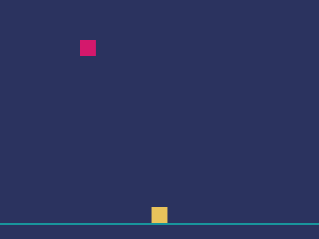</div>
</div>
</div>


---

<!-- _class: dense ch1 f2 -->
# ゲームを作ってみよう② 図形を動かす
## Making a Game 2 — Moving the Shapes

<p class="lead">座標を変えながら描画を繰り返すと、アニメーションになる <span class="en block">Repeat the drawing while shifting the coordinates, and it becomes animation</span></p>
<div class="cr" style="--code: 18px">
<div>

```python
import pyxel

pyxel.init(160, 120)
enemies = [[pyxel.rndi(0, 152), -i * 16] for i in range(16)]

while True:  #!hl
    pyxel.cls(1)
    pyxel.line(0, 112, 159, 112, 3)

    for enemy in enemies:
        enemy[1] += 2  #!hl
        if enemy[1] > 120:
            enemy[0], enemy[1] = pyxel.rndi(0, 152), -8
        pyxel.rect(enemy[0], enemy[1], 8, 8, 8)

    pyxel.rect(76, 104, 8, 8, 10)
    pyxel.flip()  #!hl
```

</div>
<div>
<div class="ph">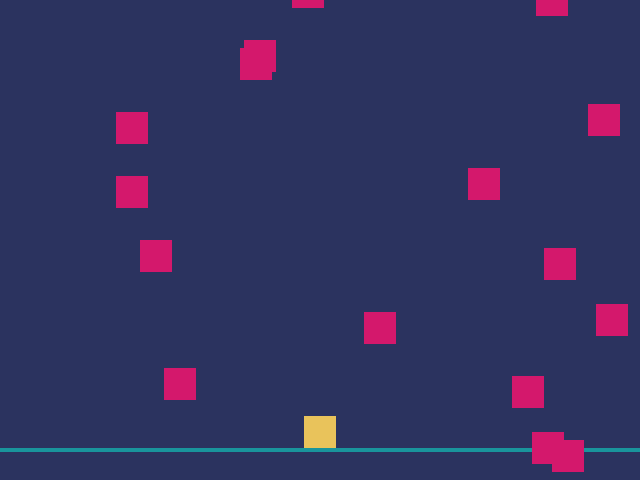</div>
</div>
</div>


---

<!-- _class: dense ch1 -->
# ゲームを作ってみよう③ キーで操作する
## Making a Game 3 — Controlling It With Keys

<p class="lead">キー入力で、キャラクターを操作できるようにする <span class="en block">Take key input to make the character controllable</span></p>
<div class="cr" style="--code: 16px">
<div>

```python
import pyxel

pyxel.init(160, 120)
x = 76
enemies = [[pyxel.rndi(0, 152), -i * 16] for i in range(16)]

while True:
    pyxel.cls(1)
    pyxel.line(0, 112, 159, 112, 3)

    if pyxel.btn(pyxel.KEY_LEFT):  #!hl
        x -= 2  #!hl
    if pyxel.btn(pyxel.KEY_RIGHT):  #!hl
        x += 2  #!hl

    for enemy in enemies:
        enemy[1] += 2
        if enemy[1] > 120:
            enemy[0], enemy[1] = pyxel.rndi(0, 152), -8
        pyxel.rect(enemy[0], enemy[1], 8, 8, 8)

    pyxel.rect(x, 104, 8, 8, 10)
    pyxel.flip()
```

</div>
<div>
<div class="ph">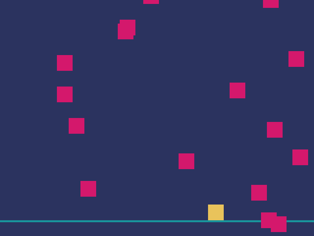</div>
</div>
</div>


---

<!-- _class: ch1 f2 -->
# ゲームを作ってみよう④ 絵と音を作る
## Making a Game 4 — Making Art and Sound

<p class="lead">同梱のPyxel Editorで、キャラクターと効果音を作る <span class="en block">Make the character and the sound effect in the bundled Pyxel Editor</span></p>

<div class="pair fit">
<figure>
<div class="ph"><video class="scr" src="assets/steps/4_image_editor.mp4" poster="assets/steps/4_image_editor_poster.png" controls preload="auto"></video></div>
<figcaption>イメージエディタ画面<span class="en block">The Image Editor screen</span></figcaption>
</figure>
<figure>
<div class="ph"><video class="scr" src="assets/steps/4_sound_editor.mp4" poster="assets/steps/4_sound_editor_poster.png" controls preload="auto"></video></div>
<figcaption>サウンドエディタ画面<span class="en block">The Sound Editor screen</span></figcaption>
</figure>
</div>


---

<!-- _class: dense ch1 -->
# ゲームを作ってみよう⑤ 絵と音を入れる
## Making a Game 5 — Adding the Art and Sound

<div class="cr" style="--code: 15px">
<div>

```python
import pyxel

pyxel.init(160, 120)
pyxel.load("game.pyxres")  #!hl
pyxel.gen_bgm(7, 0, 3, 0, play=True)  #!hl
x = 76
enemies = [[pyxel.rndi(0, 152), -i * 16] for i in range(16)]
game_over = False

while True:
    pyxel.blt(0, 0, 0, 0, 0, 160, 120)  #!hl

    if pyxel.btn(pyxel.KEY_LEFT) and not game_over:
        x -= 2
    if pyxel.btn(pyxel.KEY_RIGHT) and not game_over:
        x += 2

    for enemy in enemies:
        if not game_over:
            enemy[1] += 2
            if enemy[1] > 120:
                enemy[0], enemy[1] = pyxel.rndi(0, 152), -8
            if abs(enemy[0] - x) < 8 and abs(enemy[1] - 104) < 8:
                pyxel.play(3, 0)  #!hl
                game_over = True
        pyxel.blt(enemy[0], enemy[1], 0, 8, 120, 8, 8, 0)  #!hl

    pyxel.blt(x, 104, 0, 0, 120, 8, 8, 0)  #!hl
    pyxel.flip()
```

</div>
<div>
<div class="ph"><video class="scr" src="assets/steps/5_done.mp4" poster="assets/steps/5_done_poster.png" controls preload="auto"></video></div>
</div>
</div>


---

<!-- _class: ch1 recall f2 -->
# 制約は「学びの道具」でもあった
## Limits Were Also a Tool for Learning

<p class="lead">ないものは作り、できないことは工夫で越えた。Pyxelは「あの頃」の再現でもある <span class="en block">You built what didn’t exist and improvised past what you couldn’t do. Pyxel is a recreation of those days</span></p>

<div class="cards left" style="--shot-h: 215px">
<div class="card">
<div class="y">1986年<span class="ymean">プログラムを始めた年</span><span class="en block">I started programming in 1986</span></div>
<div class="w">調べたくてもネットは無い。雑誌やプロの作品から学び、BASICが遅ければマシン語で書いた <span class="en block">No internet. You learned from magazines and the pros, and wrote machine code when BASIC lagged</span></div>
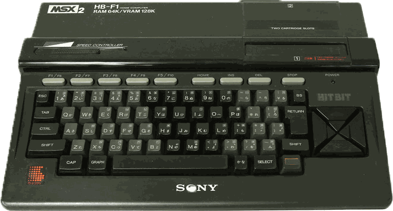
</div>
<div class="card">
<div class="y">1998年<span class="ymean">メタルギアソリッド（PS1）</span><span class="en block">MGS shipped on PS1 in 1998</span></div>
<div class="w">性能では、思い描いた3Dに届かない。ポリゴンを減らし、足りない分は見せ方で補った <span class="en block">The hardware fell short of the 3D we wanted. We cut polygons and made up the rest in the look</span></div>
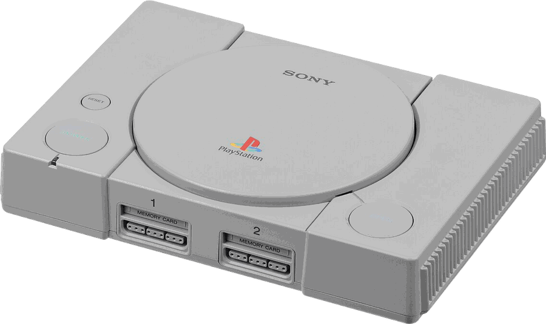
</div>
<div class="card">
<div class="y">2001年<span class="ymean">ゾーンオブエンダース（PS2）</span><span class="en block">Z.O.E shipped on PS2 in 2001</span></div>
<div class="w">開発キットは未成熟で、必要なものが揃わない。ゲームより先に、作るための道具から作った <span class="en block">The dev kits were immature and nothing we needed was there. Before the game itself, we built the tools to build it</span></div>
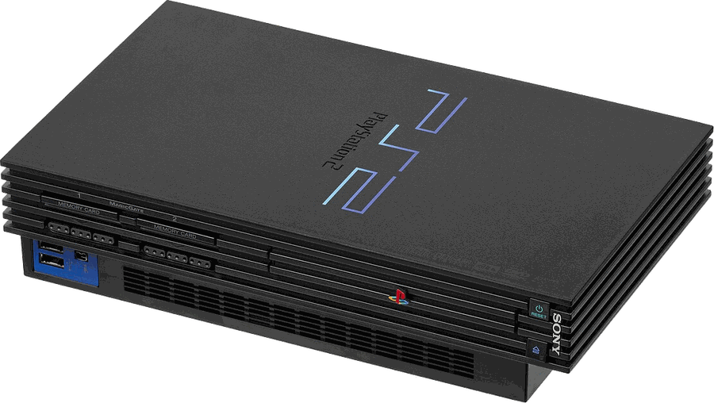
</div>
</div>


---

<!-- _class: ch1 relax -->
# 制約の外し方を遊びにする
## Making the Way Around a Limit Into Play

<p class="lead">Pyxelの存在意義は制約。その外し方を隠して、自由度と両立させている <span class="en block">The limits are why Pyxel exists. Hiding the way around them lets limits and freedom coexist</span></p>

<div class="eras" style="--cols: 2; --code: 18px">
<div class="era">
<div class="y">① 制約の解除方法を裏技化 <span class="en block">Turned the way around a limit into a cheat code</span></div>
<div class="w">配列の要素数操作や、隠しクラスのインスタンス登録で、色数や同時発音数を書き換えられる <span class="en block">Resize the arrays or register a hidden class instance, and the color and channel counts change</span></div>

```python
EXTRA_COLORS = [
    0xFF004D, 0xFFA300, 0xFFEC27, 0x00E436,
    0x29ADFF, 0x83769C, 0xFF77A8, 0xFFCCAA,
    0x291814, 0x111D35, 0x422136, 0x125359,
    0x742F29, 0x49333B, 0xA28879, 0xF3EF7D,
]
pyxel.colors[16:] = EXTRA_COLORS
pyxel.channels.append(pyxel.Channel())
```

<p class="strip"></p>

</div>
<div class="era">
<div class="y">② 上級者向けAPIを分離 <span class="en block">Split the advanced API off</span></div>
<div class="w">データの直接操作など、専門知識が必要なAPIを通常時はリファレンスで非表示に。チェックを入れると表示される <span class="en block">APIs needing specialized knowledge, like direct data access, are hidden in the reference until you tick the box</span></div>
<p class="strip shot"></p>
<p class="strip shot">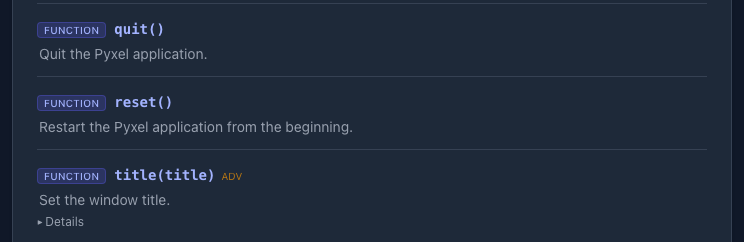</p>
</div>
</div>


---

<!-- _class: ch1 f2 -->
# Pythonならではの広がり
## What Python Opened Up

<p class="lead">日常のPythonに、出来心で <code>import pyxel</code>。そこから愉快な作品が生まれている <span class="en block">An idle <code>import pyxel</code> in everyday Python — and delightful works keep appearing</span></p>

<div class="trio shots">
<figure>
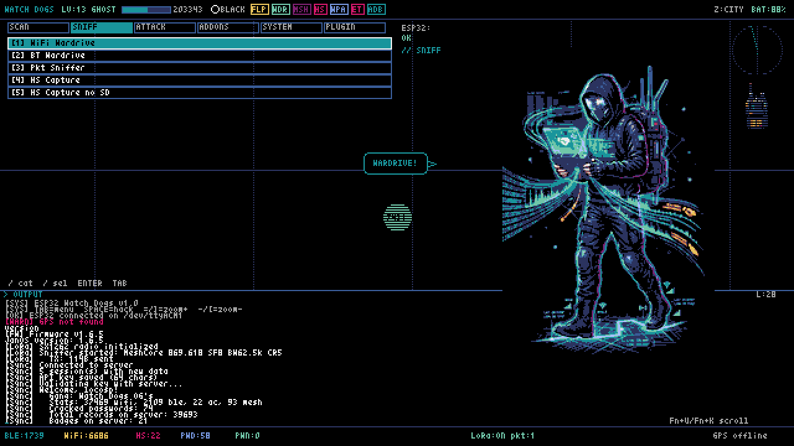
<figcaption>Watch Dogs Go<span class="sub">&copy; LOCOSP</span></figcaption>
<div class="w">ESP32の基板をつなぎ、周りのWi-FiやBluetoothを拾う。操作画面はPyxel <span class="en block">An ESP32 board picks up nearby Wi-Fi and Bluetooth. The control screen is Pyxel</span></div>
</figure>
<figure>
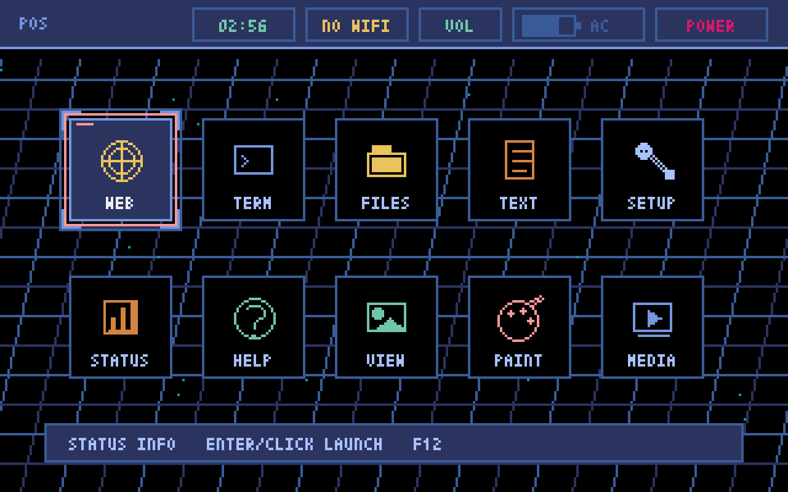
<figcaption>GPD Pocket POS<span class="sub">&copy; moto</span></figcaption>
<div class="w">7インチのPCで、デスクトップの代わりに起動。ブラウザも端末もここから開く <span class="en block">It boots on a 7-inch PC in place of the desktop. The browser and terminal open from here</span></div>
</figure>
<figure>
<video src="assets/works/penapple.mp4" poster="assets/works/penapple_poster.png" loop autoplay muted playsinline></video>
<figcaption>Pen Apple<span class="sub">&copy; RuneBlaze</span></figcaption>
<div class="w">カードの効果は文章で書くだけ。それをLLMがゲームのルールにする <span class="en block">Cards are just sentences — an LLM turns them into the game’s rules</span></div>
</figure>
</div>


---

<!-- _class: image-main ch1 -->
# アイデアを形にできると、うれしい
## Bringing Your Ideas to Life Feels Great

<p class="lead">みんなのアイデアも形になり、<a target="_blank" rel="noopener" href="https://kitao.github.io/pyxel-user-examples/">Pyxel User Examples</a>に集結 <span class="en block">Other people’s ideas took shape and gathered in Pyxel User Examples</span></p>

<p class="wall"><video src="assets/works/user_examples_wall.mp4" poster="assets/works/user_examples_wall_poster.png" loop autoplay muted playsinline></video></p>


---

<!-- _class: section ch2 -->
<p class="no ch2n"><span class="ic"><svg viewBox="0 0 24 24" fill="none" stroke="currentColor" stroke-width="1.308" stroke-linecap="round" stroke-linejoin="round"><circle cx="8.61" cy="7.39" r="3.28"/><circle cx="16.56" cy="8.45" r="2.54"/><path d="M2.68 19.89c0-3.28 2.65-5.62 5.93-5.62s5.93 2.33 5.93 5.62"/><path d="M16.56 14.49c2.76 0 4.77 2.23 4.77 5.4"/></svg></span>CHAPTER 2</p>

# みんなと作るのって、面白い
## Making Things Together Is Fun

<p class="scene">


</p>


---

<!-- _class: ch2 -->
# 遊んでもらう楽しさ
## The Fun of Having People Play

<p class="lead">作って終わりにせず、共有することで、次の展開が始まる <span class="en block">Making it is not the end — share it, and the next chapter begins</span></p>

<div class="cyc">
<div class="ring">
<svg viewBox="46 -46 925 674" role="img" aria-label="好きなものを作る、見せて遊んでもらう、感想が返ってくる、もっと作りたくなる、が輪になっている図">
  <defs>
    <marker id="ah" markerUnits="userSpaceOnUse" viewBox="0 0 24 24"
            markerWidth="24" markerHeight="24" refX="8" refY="12" orient="auto">
      <path d="M0,2.5 L21,12 L0,21.5 z" fill="var(--cy)"/>
    </marker>
  </defs>
  <g fill="none" stroke="var(--cy)" stroke-width="8" marker-end="url(#ah)">
    <path d="M580,128 A175,175 0 0 1 671,214.8"/>
    <path d="M675,357 A175,175 0 0 1 588.2,448"/>
    <path d="M446,452 A175,175 0 0 1 354,365.2"/>
    <path d="M351,223 A175,175 0 0 1 437.8,132"/>
  </g>
  <circle cx="513" cy="115" r="60" fill="var(--cyc-self)"/>
  <g transform="translate(473.0,75.0) scale(3.333)" fill="none" stroke="var(--cy)" stroke-width="1.308" stroke-linecap="round" stroke-linejoin="round"><path d="M4 20l3-.7L19.3 7a1.8 1.8 0 0 0 0-2.5l-.8-.8a1.8 1.8 0 0 0-2.5 0L3.7 16 4 20z"/></g>
  <circle cx="688" cy="290" r="60" fill="var(--cyc-other)"/>
  <g transform="translate(648.0,250.0) scale(3.333)" fill="none" stroke="var(--p8)" stroke-width="1.308" stroke-linecap="round" stroke-linejoin="round"><path d="M6.5 8h11a4.5 4.5 0 0 1 4.5 4.5A4.5 4.5 0 0 1 17.5 17h-11A4.5 4.5 0 0 1 2 12.5 4.5 4.5 0 0 1 6.5 8z"/><path d="M7 12.5h3.4M8.7 10.8v3.4M15.6 11.4h.01M18 13.6h.01"/></g>
  <circle cx="513" cy="465" r="60" fill="var(--cyc-other)"/>
  <g transform="translate(473.0,425.0) scale(3.333)" fill="none" stroke="var(--p8)" stroke-width="1.308" stroke-linecap="round" stroke-linejoin="round"><path d="M20.5 4.5h-17v11h4v4l4.2-4h8.8z"/><path d="M8 10h.01M12 10h.01M16 10h.01"/></g>
  <circle cx="338" cy="290" r="60" fill="var(--cyc-self)"/>
  <g transform="translate(298.0,250.0) scale(3.333)" fill="none" stroke="var(--cy)" stroke-width="1.308" stroke-linecap="round" stroke-linejoin="round"><path d="M3.5 17.5l5.5-5.5 3.2 3.2 7.3-7.3"/><path d="M15 7.9h4.5v4.5"/></g>
  <g font-size="35" font-weight="400">
    <text x="513" y="-13" text-anchor="middle" fill="var(--ink)" font-weight="500">好きなものを作る</text>
    <text x="770" y="240" text-anchor="start"  fill="var(--p8)" font-weight="600">見せて、</text>
    <text x="770" y="285" text-anchor="start"  fill="var(--p8)" font-weight="600">遊んでもらう</text>
    <text x="513" y="573" text-anchor="middle" fill="var(--p8)" font-weight="600">感想が返ってくる</text>
    <text x="256" y="240" text-anchor="end"    fill="var(--ink)" font-weight="500">もっと</text>
    <text x="256" y="285" text-anchor="end"    fill="var(--ink)" font-weight="500">作りたくなる</text>
  </g>
  <g font-size="22" fill="#82828e">
    <text x="513" y="30"  text-anchor="middle">You make what you like</text>
    <text x="770" y="336" text-anchor="start">You show it,</text>
    <text x="770" y="366" text-anchor="start">someone plays it</text>
    <text x="513" y="616" text-anchor="middle">A reaction comes back</text>
    <text x="256" y="336" text-anchor="end">You want to</text>
    <text x="256" y="366" text-anchor="end">make more</text>
  </g>
</svg>
</div>

<div class="keys">
<p class="keys-h">Pyxelの「共有の仕組み」 <span class="en block">How Pyxel makes sharing work</span></p>
<div class="ki"><div class="w"><b>スクリーンショット機能 <span class="en block">Screenshot &amp; screencast</span></b>
<span class="shot">
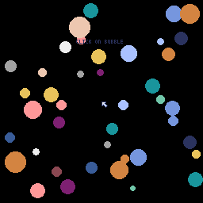
<span class="sc">
<span><kbd>Alt</kbd><kbd>1</kbd><span class="tx">画面を画像で保存 <span class="en block">Screenshot</span></span></span>
<span><kbd>Alt</kbd><kbd>3</kbd><span class="tx">直近10秒をGIFで保存 <span class="en block">Last 10s as a GIF</span></span></span>
</span>
</span></div></div>
<div class="ki"><div class="w"><b>作品共有の場</b>：<a target="_blank" rel="noopener" href="https://kitao.github.io/pyxel-user-examples/">Pyxel User Examples</a> <span class="en block">A place to share your work — Pyxel User Examples</span></div></div>
<div class="ki"><div class="w"><b>配布用形式</b>：<span class="nm">Pyxelアプリケーションファイル</span> <span class="en block">A distribution format — the Pyxel application file</span></div></div>
</div>
</div>


---

<!-- _class: ch2 f2 -->
# Pyxelアプリケーションファイル
## Pyxel Application File

<p class="lead">必要なファイルを1つに詰めたPyxel専用のファイル形式。コマンド1つで作成・実行できる <span class="en block">A Pyxel-specific file format that packs everything into one file — one command to build, one to run</span></p>

<div class="pack">
<div class="step-box before">
<div class="bh"><i class="no">1</i>必要なファイルを揃える <span class="en block">Gather everything it needs</span></div>
<div class="items">
<div class="it"><span class="sq c1"></span><span>Pythonのコード <span class="en block">Python files</span></span></div>
<div class="it"><span class="sq c2"></span><span>絵と音（.pyxres） <span class="en block">Art and sound</span></span></div>
<div class="it"><span class="sq c3"></span><span>その他のファイル <span class="en block">Whatever else it needs</span></span></div>
</div>
</div>

<div class="op"><i class="no">2</i><code>pyxel package</code><span class="ar">→</span><span class="cap">1つにまとめる <span class="en">bundles it into one</span></span></div>

<div class="step-box file">

<div class="bh">Pyxelアプリケーション<br>ファイル <span class="en block">Pyxel application file</span></div>
<div class="fn">（.pyxapp）</div>
</div>

<div class="op"><i class="no">3</i><code>pyxel play</code><span class="ar">→</span><span class="cap">実行する <span class="en">runs it</span></span></div>

<div class="step-box after">
<div class="bh"><i class="no">4</i>OSを選ばず動く <span class="en block">It works on any OS</span></div>
<div class="items">
<div class="it"><span class="sq c4"></span><span>Windows・Mac・Linux対応 <span class="en block">Windows, Mac, and Linux</span></span></div>
<div class="it"><span class="sq c5"></span><span>展開も配置も不要 <span class="en block">No unpacking, no placing</span></span></div>
<div class="it"><span class="sq c6"></span><span>SNS・ゲームジャムで共有 <span class="en block">Share it online or at a game jam</span></span></div>
</div>
</div>
</div>

<p class="issue"><b>残る課題<span class="en block">Still unsolved</span></b><span class="tx">PythonとPyxelがインストールされた環境でないと、渡しても動かせない <span class="en block">Unless Python and Pyxel are installed, handing it over gets them nowhere</span></span></p>


---

<!-- _class: dense ch2 -->
# Web版Pyxelへの道のり
## The Road to Pyxel on the Web

<p class="lead">コミュニティと周辺プロジェクトを巻き込んだ「みんなと作る」総力戦になった <span class="en block">It became an all-out effort &mdash; making things together with the community and nearby projects</span></p>

<div class="chron">
<div class="timeline">
<div class="tp"><div class="y">2018年10月</div><div class="w"><span class="pn">jahodfra</span>氏が「<span class="tm">Brython</span>で動かせないか」とissueに書き込み <span class="en block">jahodfra asks in an issue: could Brython run it?</span></div></div>
<div class="tp"><div class="y">2021年12月</div><div class="w">13ヶ月かけて、コアエンジンのC++から<span class="tm">Rust</span>への移行が完了する <span class="en block">After 13 months, the core engine finishes moving from C++ to <span class="tm">Rust</span></span></div></div>
<div class="tp"><div class="y">2022年5月</div><div class="w"><span class="pn">km19809</span>氏が数ヶ月かけて、コアエンジンの<span class="tm">WASM</span>化に成功する <span class="en block">km19809 spends several months and compiles the core engine to WASM</span></div></div>
<div class="tp"><div class="y">2022年8月</div><div class="w"><span class="tm">maturin</span>の<span class="pn">messense</span>氏と共に、Python側も<span class="tm">WASM</span>化する <span class="en block">With messense of maturin, we compile the Python side too</span></div></div>
<div class="tp"><div class="y">2022年9月</div><div class="w"><span class="tm">SDL</span>向けに改造した<span class="tm">Pyodide</span>を同梱して、Web版を公開開始 <span class="en block">Pyxel ships for the web with a Pyodide we modified for SDL</span></div></div>
<div class="tp"><div class="y">2023年4月</div><div class="w"><span class="tm">Pyodide</span>の<span class="pn">Choi</span>氏が<span class="tm">SDL</span>対応を実装。改造版の同梱が不要になる <span class="en block">Choi of Pyodide lands SDL support, and the modified build is no longer bundled</span></div></div>
</div>

<div class="gloss">
<div class="g"><div><b>Brython</b><span>PythonをJavaScriptに変換して動かす実装 <span class="en block">Runs Python by translating it to JavaScript</span></span></div></div>
<div class="g"><div><b>Rust</b><span>Web等の各種環境向けにコンパイルできる言語 <span class="en block">Compiles to many targets, including the web</span></span></div></div>
<div class="g">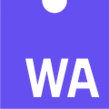<div><b>WASM</b><span>ブラウザが直接実行できる、機械語に近い形式 <span class="en block">A near-machine-code format browsers run directly</span></span></div></div>
<div class="g"><div><b>Pyodide</b><span>Python本体をWASMにコンパイルした実装 <span class="en block">CPython itself, compiled to WASM</span></span></div></div>
<div class="g"><div><b>maturin</b><span>Rust製のPython拡張をパッケージにするツール <span class="en block">Packages Rust-built Python extensions</span></span></div></div>
<div class="g"><div><b>SDL</b><span>画面・音・入力を扱うライブラリ <span class="en block">A library for screen, sound, and input</span></span></div></div>
</div>
</div>


---

<!-- _class: ch2 f2 -->
# Web版Pyxelの仕組み
## How Pyxel Works on the Web

<div class="webw">
<div class="steps">
<div class="step"><div class="n">1</div><div class="w">Pyxel本体をCDNサーバーに置き、インストールなしで実行<span class="en block">Pyxel sits on a CDN — it runs with no install</span><span class="d">pyxel.jsスクリプトが、Python実行環境（Pyodide）とPyxel本体を読み込む<span class="en block">The pyxel.js script pulls in Pyodide (a Python runtime) and Pyxel itself</span></span></div></div>
<div class="step"><div class="n">2</div><div class="w">独自のHTMLタグを定義し、HTML内にPythonを直接記述<span class="en block">A custom HTML tag lets Python live right inside the HTML</span><span class="d">ブラウザがタグを見つけると、中身のコードを取り出してPyxelに渡す<span class="en block">When the browser finds the tag, it hands the code inside to Pyxel</span></span></div></div>
<div class="step"><div class="n">3</div><div class="w">pyxappを<code>pyxel app2html</code>コマンドでHTMLに変換<span class="en block">The pyxel app2html command turns a pyxapp into a standalone HTML file</span><span class="d">pyxappをBase64エンコードし、復元コードとともにHTMLに書き込む<span class="en block">The pyxapp is Base64-encoded and written into the HTML with the code that restores it</span></span></div></div>
</div>

<div class="webcode">

```html
<script src="https://cdn.jsdelivr.net/gh/kitao/pyxel/wasm/pyxel.js"></script>

<pyxel-run script="
import pyxel
pyxel.init(200, 150)
pyxel.cls(8)
pyxel.line(20, 20, 180, 130, 7)
pyxel.show()
"></pyxel-run>
```

<p class="webtry"><a target="_blank" rel="noopener" href="https://kitao.github.io/pyconjp2026-keynote/demo/web/pyxel-run.html">HTMLファイルを開く</a> <span class="en block">Open the HTML file</span></p>

</div>
</div>


---

<!-- _class: dense ch2 -->
# URLだけで遊べる究極形へ
## The Ultimate Form: Play From a URL Alone

<p class="lead"><a target="_blank" rel="noopener" href="https://kitao.github.io/pyxel/web/launcher/">Pyxel Web Launcher</a> — GitHubに置いたファイルを、URLで指定して起動する <span class="en block">Pyxel Web Launcher — point a URL at a file on GitHub to launch it</span></p>

<p class="urlmap">
<span class="sg fx"><b>https://kitao.github.io/pyxel/web/launcher/</b><i>ランチャーの場所<span class="en block">the launcher</span></i></span>
<span class="sg s1"><b>?run=</b><i>コマンド<span class="en block">command</span></i></span>
<span class="sg s2"><b>taro</b><i>ユーザー<span class="en block">user</span></i></span>
<span class="sg sp"><b>/</b></span>
<span class="sg s3"><b>my_repo</b><i>リポジトリ<span class="en block">repo</span></i></span>
<span class="sg sp"><b>/</b></span>
<span class="sg s4"><b>main</b><i>ブランチ<span class="en block">branch</span></i></span>
<span class="sg sp"><b>/</b></span>
<span class="sg s5"><b>src/title</b><i>パス<span class="en block">path</span></i></span></p>

<div class="flow">
<div class="fb"><div class="fh"><span class="sq c1"></span><span class="ft-h">URLを開く<span class="en block">Open the URL</span></span></div><div class="ft"><span>ランチャーがリポジトリ名とファイル名をURLから読み取る<span class="en block">The launcher reads the repository and file names from the URL</span></span></div></div>
<div class="fa"></div>
<div class="fb"><div class="fh"><span class="sq c3"></span><span class="ft-h">CDNから取得<span class="en block">Fetch from the CDN</span></span></div><div class="ft"><span>Pyxel本体とGitHubのファイルをダウンロードする<span class="en block">It downloads Pyxel itself and the files from GitHub</span></span></div></div>
<div class="fa"></div>
<div class="fb"><div class="fh"><span class="sq c6"></span><span class="ft-h">ブラウザで実行<span class="en block">Run in the browser</span></span></div><div class="ft"><span>ダウンロードしたファイルをWeb版Pyxelに渡して動かす<span class="en block">It hands the downloaded files to Pyxel for the web and runs them</span></span></div></div>
</div>

<p class="fnote">共有の準備は必要なく、GitHubで公開されていれば、そのまま遊べる<span class="en block">No setup to share — if it is public on GitHub, it just plays</span><span class="qrslot"></span></p>


---

<!-- _class: ch2 f2 -->
# Web技術で広がる可能性
## What Web Tech Opens Up

<p class="lead">他の技術と繋がり、別の環境に組み込める。Webならではのアプリの形が見えた <span class="en block">Wired to other tech, embedded elsewhere — a kind of app possible only on the web came into view</span></p>

<div class="cards" style="--shot-h: 300px">
<div class="card">
<div class="y"><span class="tt">Pyxel Code Maker<span class="en block">Pyxel Code Maker</span></span></div>
<div class="w"><span class="tt kn">ブラウザ上で動く統合開発環境 <span class="en block">An IDE that runs in the browser</span></span></div>
<div class="ph">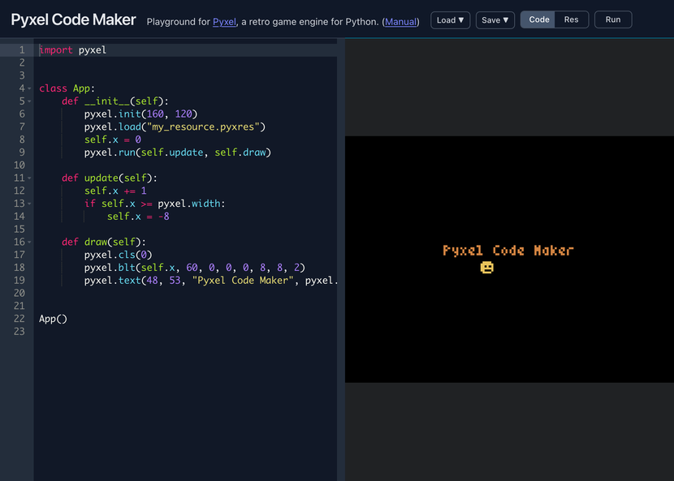</div>
</div>
<div class="card">
<div class="y"><span class="tt">Pyxel VS Code拡張<span class="en block">Pyxel VS Code extension</span></span></div>
<div class="w"><span class="tt">VS Code上で動く実行環境 <span class="en block">A runtime that runs inside VS Code</span></span></div>
<div class="ph">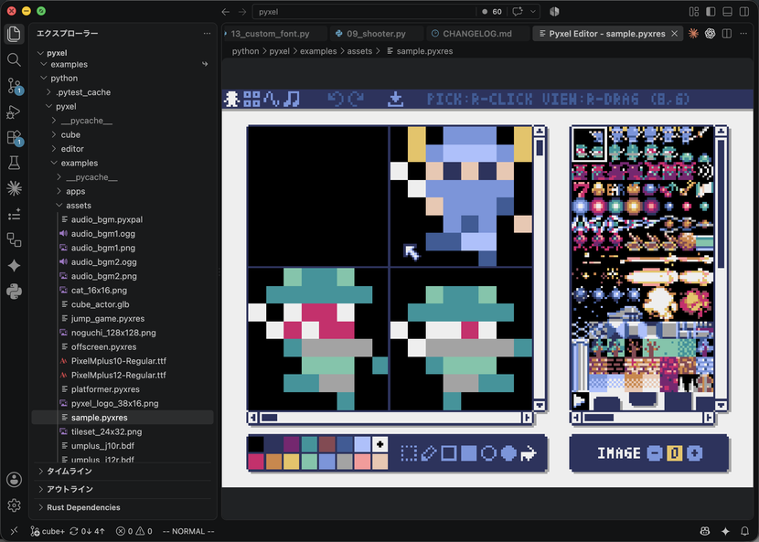</div>
</div>
<div class="card">
<div class="y"><span class="tt">Pyxel MML Studio<span class="en block">Pyxel MML Studio</span></span></div>
<div class="w"><span class="tt">Pyxel MMLの音楽制作ツール <span class="en block">A music tool for Pyxel MML</span></span></div>
<div class="ph">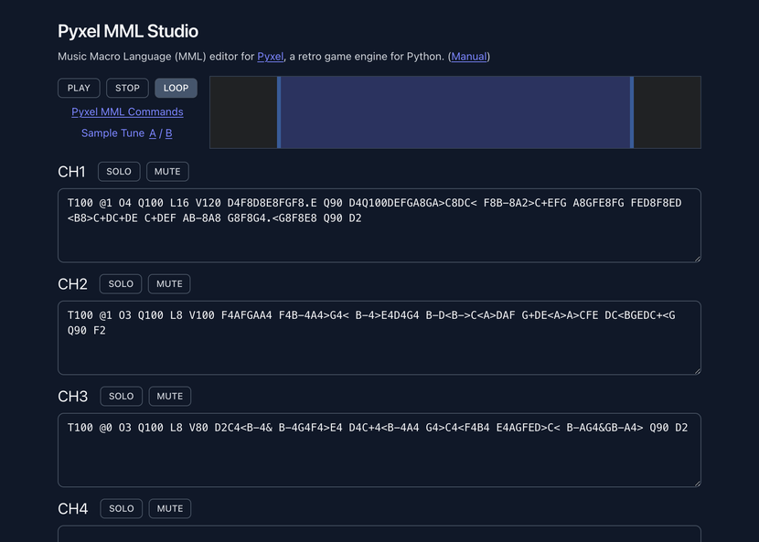</div>
</div>
</div>


---

<!-- _class: two-up ch2 demo -->
# Web技術の応用① Pyxel Code Maker
## Applying Web Tech 1 — Pyxel Code Maker

<p class="lead">教室で最初につまずくのは、環境構築 ── ならIDEごとWebアプリにしよう <span class="en block">The first wall in a classroom is setup — so make the IDE itself a web app</span></p>

<p class="applink"><span class="hd"><span class="badge"></span><span class="ttl"><a class="nm" target="_blank" rel="noopener" href="https://kitao.github.io/pyxel/web/code-maker/">Pyxel Code Maker</a><span class="en block">Pyxel Code Maker</span></span></span><span class="tt kn">ブラウザ上で動く統合開発環境<span class="en block">An IDE that runs in the browser</span></span></p>
<div class="ph wide">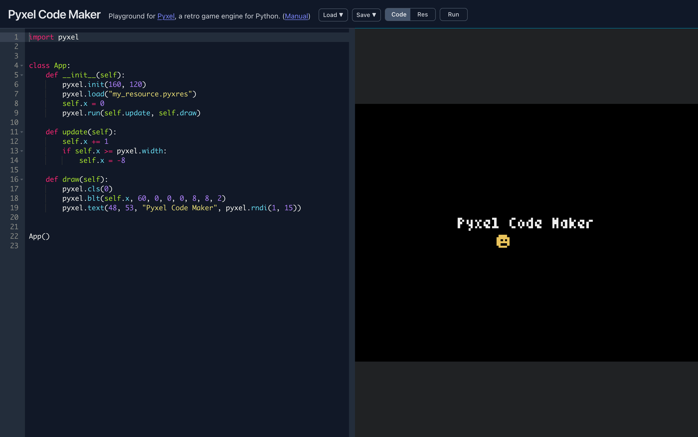</div>


---

<!-- _class: two-up ch2 f2 demo -->
# Web技術の応用② Pyxel VS Code拡張
## Applying Web Tech 2 — Pyxel VS Code Extension

<p class="lead">VS Codeの中身はブラウザ ── じゃあ、Pyxelをそのまま動かせるはず <span class="en block">VS Code is a browser inside — so Pyxel should just run there</span></p>

<p class="applink"><span class="hd"><span class="badge"></span><span class="ttl"><a class="nm" target="_blank" rel="noopener" href="https://marketplace.visualstudio.com/items?itemName=kitao.pyxel-vscode">Pyxel VS Code拡張</a><span class="en block">Pyxel VS Code extension</span></span></span><span class="tt">VS Code上で動く実行環境<span class="en block">A runtime that runs inside VS Code</span></span></p>
<div class="ph wide">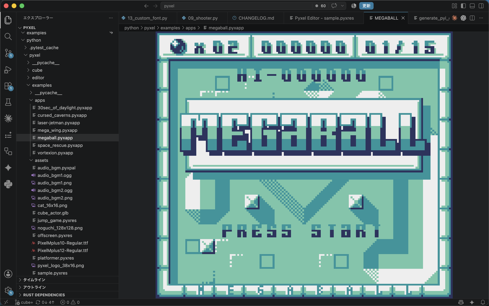</div>


---

<!-- _class: two-up ch2 demo -->
# Web技術の応用③ Pyxel MML Studio
## Applying Web Tech 3 — Pyxel MML Studio

<p class="lead">音楽が文字列で書けるなら ── 曲はQRコードに丸ごと入るのでは？ <span class="en block">If music is just text — then maybe a whole tune fits in a QR code?</span></p>

<div class="col-l">
<p class="applink"><span class="hd"><span class="badge"></span><span class="ttl"><a class="nm" target="_blank" rel="noopener" href="https://kitao.github.io/pyxel/web/mml-studio/">Pyxel MML Studio</a><span class="en block">Pyxel MML Studio</span></span></span><span class="tt">Pyxel MMLの音楽制作ツール<span class="en block">A music tool for Pyxel MML</span></span></p>
<div class="nt"><b>MML（Music Macro Language）</b>音楽を文字列で書く記法<span class="en block">A notation for writing music as text</span><span class="ex"><code>T120 O4 L8 CDEFGAB&gt;C</code><span class="cm">テンポ120・オクターブ4・8分音符で、ドレミファソラシド<span class="en block">Tempo 120, octave 4, eighth notes — then the scale</span></span></span></div>
</div>
<div class="ph wide">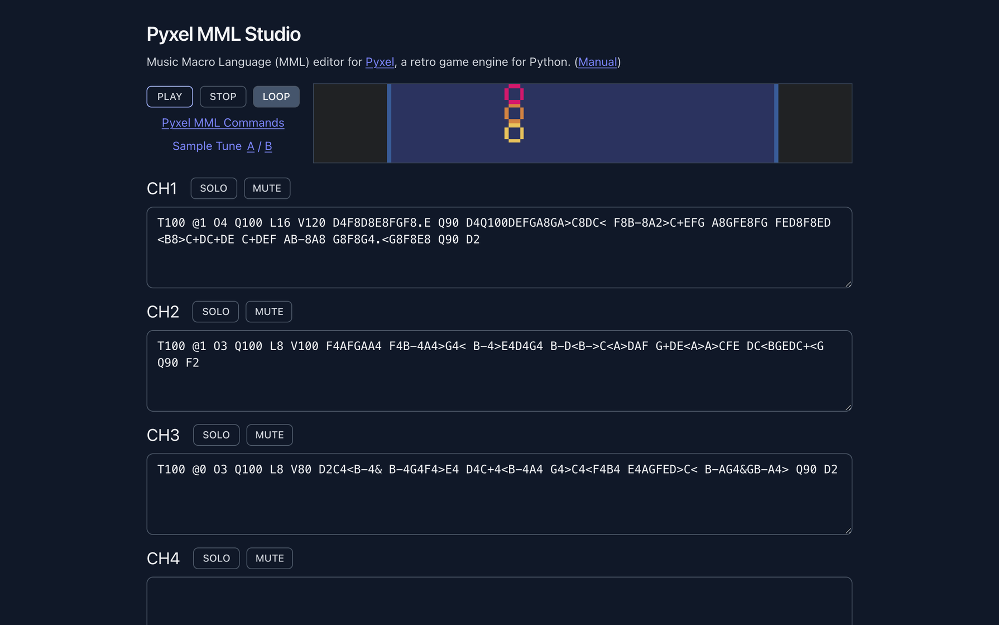</div>


---

<!-- _class: two-up dense ch2 f2 -->
# みんなと作るのって、面白い
## Making Things Together Is Fun

<div class="col-l adopt">
<div class="ad"><span class="badge"><svg viewBox="0 0 24 24" fill="none" stroke="currentColor" stroke-width="1.308" stroke-linecap="round" stroke-linejoin="round"><path d="M20.74 11a.93 .93 0 0 0-.02-1.71L12.75 5.66a1.86 1.86 0 0 0-1.54 0L3.23 9.28a.93 .93 0 0 0 0 1.7l7.97 3.64a1.86 1.86 0 0 0 1.54 0z"/><path d="M21.28 10.14v5.58"/><path d="M6.39 12.47V15.72a5.58 2.79 0 0 0 11.16 0v-3.26"/></svg></span><div class="b"><b>教育機関への展開<span class="en block">Into schools and universities</span></b><span class="it"><span class="n">フランスの高校情報科（NSI）</span> ── 国の公式教材に採用<span class="en block">Official course material for French high-school CS</span></span><span class="it"><span class="n">大学の授業</span> ── 慶應SFC・大阪大学・スペインUC3M・ニュージーランドUnitec<span class="en block">Keio SFC, Osaka Univ., UC3M (Spain), Unitec (NZ)</span></span></div></div>
<div class="ad"><span class="badge"><svg viewBox="0 0 24 24" fill="none" stroke="currentColor" stroke-width="1.308" stroke-linecap="round" stroke-linejoin="round"><line x1="6.63" x2="10.21" y1="11.11" y2="11.11"/><line x1="8.42" x2="8.42" y1="9.31" y2="12.89"/><line x1="14.69" x2="14.69" y1="12" y2="12"/><line x1="17.37" x2="17.38" y1="10.21" y2="10.21"/><path d="M16.76 5.73H7.24a3.58 3.58 0 0 0-3.56 3.21c-.01 .04-.01 .09-.02 .13C3.59 9.69 3.05 14.2 3.05 15.58a2.69 2.69 0 0 0 2.69 2.69c.9 0 1.34-.45 1.79-.9l1.26-1.26A1.79 1.79 0 0 1 10.06 15.58h3.88a1.79 1.79 0 0 1 1.26 .53L16.48 17.37c.45 .45 .9 .9 1.79 .9a2.69 2.69 0 0 0 2.69-2.69c0-1.39-.54-5.89-.62-6.5A3.58 3.58 0 0 0 16.76 5.73"/></svg></span><div class="b"><b>ゲームジャムへの展開<span class="en block">Into game jams</span></b><span class="it"><span class="n">Nuit du Code</span> ── 61か国・609校が参加する6時間の制作マラソン<span class="en block">A 6-hour marathon — 609 schools in 61 countries</span></span><span class="it"><span class="n">Scientific Game Jam</span> ── 科学をテーマにした48時間のジャム。高校生チームがPyxelで制作<span class="en block">A 48-hour jam on science — a high-school team used Pyxel</span></span></div></div>
</div>

<div class="col-r even">
<div class="ph">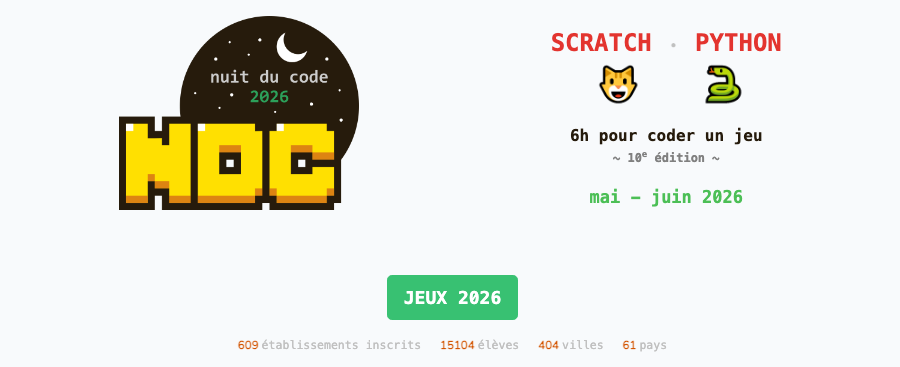</div>
<div class="ph">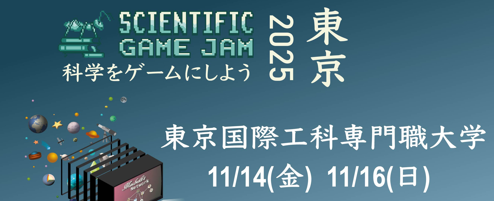</div>
</div>


---

<!-- _class: section ch3 -->
<p class="no ch3n"><span class="ic"><svg viewBox="0 0 24 24" fill="none" stroke="currentColor" stroke-width="1.308" stroke-linecap="round" stroke-linejoin="round"><path d="M12.28 2.67c2.27 2.46 3.6 5.68 3.6 9.09 0 2.46-1.23 4.92-3.6 7.01-2.37-2.08-3.6-4.54-3.6-7.01 0-3.41 1.33-6.63 3.6-9.09z"/><circle cx="12.28" cy="9.21" r="1.7"/><path d="M8.78 13.47 6.13 16.31v2.84l2.84-1.61M15.79 13.47l2.65 2.84v2.84l-2.84-1.61"/><path d="M12.28 19.05v2.27"/><path d="M4.9 4.57l.38 1.14 1.14 .38-1.14 .38-.38 1.14-.38-1.14L3.39 6.08l1.14-.38z"/><path d="M19.48 5.33l.28 .85 .85 .28-.85 .28-.28 .85-.28-.85-.85-.28 .85-.28z"/></svg></span>CHAPTER 3</p>

# これからのPyxelは、もっと楽しい！
## Pyxel’s Future Is Even More Exciting!

<p class="scene">


</p>


---

<!-- _class: ch3 aipage -->
# AI時代に「楽しく作る」は必要か？
## Does the Joy of Making Still Matter in the Age of AI?

<div class="vs">
<div class="side world">
<div class="hd">AIが書くコードの割合は年々上昇中<span class="en block">The share of AI-written code climbs year after year</span></div>
<div class="fig"><div class="lb"><div class="t">AI生成・支援の<br>コードの割合<span class="en block">Share of AI-generated or assisted code</span></div><div class="src">Sonar「State of Code」2026<br>2026年以降は見通し<span class="en block">Sonar State of Code 2026.<br>2026 onward is an outlook.</span></div></div><svg class="g" viewBox="0 0 700 680" aria-label="コミットしたコードのうちAIが生成・支援した割合の推移">
  <defs>
    <linearGradient id="gl" x1="0" y1="0" x2="0" y2="1">
      <stop offset="0" stop-color="var(--era1)" stop-opacity=".45"/>
      <stop offset="1" stop-color="var(--era1)" stop-opacity=".10"/>
    </linearGradient>
  </defs>
  <g stroke="var(--chart-grid)" stroke-width="2" fill="none">
    <path d="M70 465h554M70 340h554M70 215h554"/>
  </g>
  <path d="M155 552 267 471 379 327 379 590 155 590z" fill="url(#gl)"/>
  <g fill="none" stroke-linecap="round" stroke-linejoin="round">
    <path d="M70 590h554M70 60v530" stroke="var(--chart-axis)" stroke-width="3"/>
    <path d="M155 552 267 471 379 327" stroke="var(--g-world)" stroke-width="13"/>
    <path d="M379 327 491 246 603 184" stroke="#7aa2e8" stroke-width="13" stroke-dasharray="18 14"/>
  </g>
  <g>
    <circle cx="155" cy="552" r="11" fill="var(--g-world)"/>
    <circle cx="267" cy="471" r="11" fill="var(--g-world)"/>
    <circle cx="379" cy="327" r="22" fill="var(--g-world)"/>
    <circle cx="491" cy="246" r="12" fill="#fff" stroke="#7aa2e8" stroke-width="6"/>
    <circle cx="603" cy="184" r="12" fill="#fff" stroke="#7aa2e8" stroke-width="6"/>
  </g>
  <g text-anchor="middle" stroke="#fff" stroke-width="6" paint-order="stroke" stroke-linejoin="round">
    <text x="155" y="521" fill="#33405c" font-size="34" font-weight="500">6%</text>
    <text x="267" y="440" fill="#33405c" font-size="34" font-weight="500">19%</text>
    <text x="379" y="280" fill="var(--g-world)" font-size="64" font-weight="600">42%</text>
    <text x="491" y="205" fill="#7aa2e8" font-size="34" font-weight="500">55%</text>
    <text x="603" y="143" fill="#7aa2e8" font-size="46" font-weight="600">65%</text>
  </g>
  <g fill="var(--chart-tick)" font-size="26" text-anchor="end">
    <text x="56" y="100">80</text>
    <text x="56" y="350">40</text>
    <text x="56" y="600">0</text>
  </g>
  <g fill="var(--chart-cat)" font-size="30" text-anchor="middle">
    <text x="155" y="640">2023</text>
    <text x="267" y="640">2024</text>
    <text x="379" y="640">2025</text>
    <text x="491" y="640">2026</text>
    <text x="603" y="640">2027</text>
  </g>
</svg></div>
<div class="msg">プログラミングとの関わり方が変わる<span class="en block">How people take part in programming is changing</span></div>
</div>

<div class="side mine">
<div class="hd">新たに開発者となる人も増加中<span class="en block">And more and more people are becoming developers</span></div>
<div class="fig"><div class="lb"><div class="t">GitHubに参加した<br>新規開発者数<span class="en block">New developers per year on GitHub</span></div><div class="src">GitHub Octoverse<br>2023・2024年は算出値<span class="en block">GitHub Octoverse.<br>2023 and 2024 are derived.</span></div></div><svg class="g" viewBox="0 0 700 680" aria-label="GitHubに参加した新規開発者数の推移">
  <defs>
    <linearGradient id="gr" x1="0" y1="0" x2="0" y2="1">
      <stop offset="0" stop-color="#19959c" stop-opacity=".45"/>
      <stop offset="1" stop-color="#19959c" stop-opacity=".10"/>
    </linearGradient>
  </defs>
  <g stroke="var(--chart-grid)" stroke-width="2" fill="none">
    <path d="M110 560h514M110 325h514M110 90h514"/>
  </g>
  <path d="M164 548 300 457 436 419 572 184 572 590 164 590z" fill="url(#gr)"/>
  <g fill="none" stroke-linecap="round" stroke-linejoin="round">
    <path d="M110 590h514M110 60v530" stroke="var(--chart-axis)" stroke-width="3"/>
    <path d="M164 548 300 457 436 419 572 184" stroke="var(--g-mine)" stroke-width="13"/>
    <circle cx="164" cy="548" r="11" fill="var(--g-mine)"/>
    <circle cx="300" cy="457" r="11" fill="var(--g-mine)"/>
    <circle cx="436" cy="419" r="11" fill="var(--g-mine)"/>
    <circle cx="572" cy="184" r="22" fill="var(--g-mine)"/>
    <path d="M92 572q9-11 18 0t18 0" stroke="var(--chart-axis)" stroke-width="3"/>
    <path d="M92 584q9-11 18 0t18 0" stroke="var(--chart-axis)" stroke-width="3"/>
  </g>
  <g text-anchor="middle" stroke="#fff" stroke-width="6" paint-order="stroke" stroke-linejoin="round">
    <text x="164" y="517" fill="#2c6167" font-size="34" font-weight="500">2,050万</text>
    <text x="300" y="426" fill="#2c6167" font-size="34" font-weight="500">2,440万</text>
    <text x="436" y="396" fill="#2c6167" font-size="34" font-weight="500">2,600万</text>
    <text x="546" y="160" text-anchor="end" fill="var(--g-mine)" font-size="64" font-weight="600">3,600万</text>
  </g>
  <g fill="var(--chart-tick)" font-size="26" text-anchor="end">
    <text x="96" y="100">4000</text>
    <text x="96" y="335">3000</text>
    <text x="96" y="570">2000</text>
  </g>
  <g fill="var(--chart-cat)" font-size="30" text-anchor="middle">
    <text x="164" y="640">2022</text>
    <text x="300" y="640">2023</text>
    <text x="436" y="640">2024</text>
    <text x="572" y="640">2025</text>
  </g>
</svg></div>
<div class="msg">作りたい人は、実はたくさんいる<span class="en block">There are, in fact, plenty of people who want to make</span></div>
</div>
</div>

<p class="concl">何を作るか考え、方向づけるのは人の役割。「情熱を育てる」仕掛けがより重要に<span class="en block">Setting the goal and giving direction is the human role — and devices that grow the passion matter more than ever</span></p>


---

<!-- _class: ch3 f2 rolepage -->
# 「楽しく作る」ためのAIの立ち位置
## Where AI Stands in the Joy of Making

<p class="lead">AIはやる気を奪うものではなく、「作る楽しさ」を広げるパートナーになれる<span class="en block">AI does not take away the will to make — it can be a partner that widens the joy of making</span></p>

<div class="roles">
<div class="role">
<div class="hd"><span class="n">1</span><span class="w">チームメンバーの一員として<span class="en block">As one of the team members</span></span></div>
<div class="d">人と同じように担当を持ち、一緒に作る<span class="en block">AI holds a role just like the others, and builds together</span></div>
<div class="fig"><div class="dia team">
<figure class="ch"><span class="bub none"></span>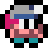<figcaption>ゲーム担当<i>Game logic</i><b class="hu">Human</b></figcaption></figure>
<figure class="ch"><span class="bub">ここは任せて<i>Leave it to me</i></span><figcaption>ツール担当<i>Tools</i><b class="ai">AI</b></figcaption></figure>
<figure class="ch"><span class="bub none"></span><figcaption>グラフィック担当<i>Art</i><b class="hu">Human</b></figcaption></figure>
<figure class="ch"><span class="bub">いい音にするね<i>I’ll make it sound good</i></span><figcaption>効果音担当<i>Sound effects</i><b class="ai">AI</b></figcaption></figure>
<figure class="ch"><span class="bub none"></span><figcaption>音楽担当<i>Music</i><b class="hu">Human</b></figcaption></figure>
</div></div>
<div class="acts"><span>アイデアを出す<i>Generate ideas</i></span><span>コードを書く<i>Write code</i></span><span>動かして試す<i>Run and test</i></span><span>改善する<i>Improve</i></span></div>
</div>
<div class="role">
<div class="hd"><span class="n">2</span><span class="w">チームメンバーをつなぐ役として<span class="en block">As the one who connects the team</span></span></div>
<div class="d">AIが橋渡しをして、国や言葉の違う人と一緒に作る<span class="en block">AI bridges people across countries and languages</span></div>
<div class="fig"><div class="dia bridge">
<figure class="ch"><span class="bub none"></span><figcaption>あなた<i>You</i><b class="hu">Human</b></figcaption></figure>
<div class="arw"><b>つなぐ</b><span>←</span><i>Connect</i></div>
<figure class="ch"><span class="bub none"></span><figcaption>つなぐ役<i>Connector</i><b class="ai">AI</b></figcaption></figure>
<div class="arw"><b>見つける</b><span>→</span><i>Find</i></div>
<div class="grp"><div class="row2"><figure class="ch"><span class="bub">Bonjour</span></figure><figure class="ch"><span class="bub">Hello</span></figure><figure class="ch"><span class="bub">안녕하세요</span>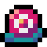</figure></div>
<div class="gcap">まだ知らない仲間<i>People you haven’t met</i><b class="hu">Human</b></div></div>
</div></div>
<div class="acts"><span>仲間を見つける<i>Find people</i></span><span>会話を翻訳する<i>Translate</i></span><span>意図を伝える<i>Convey intent</i></span><span>段取りを組む<i>Coordinate</i></span></div>
</div>
</div>


---

<!-- _class: ch3 trialpage -->
# AI時代へのPyxelの対応
## How Pyxel Is Meeting the Age of AI

<p class="lead">人の使い方は変えずに、AIのための道具を新たに開発<span class="en block">Without changing how people use it, new tools built for AI</span></p>

<div class="cols">
<div class="col">
<div class="ch"><span class="badge"></span><span class="nm"><a target="_blank" rel="noopener" href="https://github.com/kitao/pyxel-mcp">pyxel-mcp</a><span class="en block">MCP準拠 / Built on MCP</span></span><span class="plug"><svg viewBox="6 8 308 65" aria-label="AIとPyxelをMCPの差込口でつなぐ図">
  <g fill="none" stroke="var(--line-fig)" stroke-width="3.5" stroke-linecap="round">
    <path d="M54 42h22"/>
    <path d="M224 42h18"/>
  </g>
  <g class="pl">
    <rect x="76" y="30" width="34" height="24" rx="5"/>
    <rect x="190" y="30" width="34" height="24" rx="5"/>
  </g>
  <rect x="110" y="14" width="80" height="56" rx="10" class="hub"/>
  <g class="pt">
    <rect x="116" y="24" width="7" height="14" rx="3"/>
    <rect x="116" y="46" width="7" height="14" rx="3"/>
    <rect x="177" y="24" width="7" height="14" rx="3"/>
    <rect x="177" y="46" width="7" height="14" rx="3"/>
  </g>
  <text x="150" y="47" class="hb" text-anchor="middle">MCP</text>
  <text x="32" y="47" class="sd" text-anchor="middle">AI</text>
  <text x="276" y="47" class="sd" text-anchor="middle">Pyxel</text>
</svg><em>AIと道具をつなぐ共通の差込口<i>A common plug between AI and tools</i></em></span></div>
<div class="d">AI用Pyxel操作ツールキット<span class="en block">A Pyxel toolkit for AI</span></div>
<div class="figL"><div class="fts">
<span class="ft run hi"><span class="ic"><svg viewBox="0 0 24 24" fill="currentColor" stroke="currentColor"><path d="M2.37 4.61l8.44 7.39-8.44 7.39V4.61zM12.92 4.61l8.44 7.39-8.44 7.39V4.61z"/></svg></span><span class="tx"><b>超早送り実行<i>Turbo run</i></b><em>通常の300倍速で実行<i>Runs at 300&times; normal speed</i></em></span></span>
<span class="ft chk"><span class="ic"><svg viewBox="0 0 24 24" fill="currentColor" stroke="currentColor"><circle cx="9.83" cy="9.83" r="6.89" fill="none" stroke-width="1.308"/><path d="M15.13 15.13L20.96 20.96" stroke-width="1.438" stroke-linecap="round"/><path d="M6.96 9.93l2.01 2.01 3.6-3.82" fill="none" stroke-width="1.178" stroke-linecap="round" stroke-linejoin="round"/></svg></span><span class="tx"><b>事前ミス検出<i>Static checks</i></b><em>動かす前に誤りを見つける<i>Finds errors before it runs</i></em></span></span>
<span class="ft run"><span class="ic"><svg viewBox="0 0 24 24" fill="none" stroke="currentColor" stroke-width="1.308" stroke-linecap="round" stroke-linejoin="round"><line x1="6.63" x2="10.21" y1="11.11" y2="11.11"/><line x1="8.42" x2="8.42" y1="9.31" y2="12.89"/><line x1="14.69" x2="14.69" y1="12" y2="12"/><line x1="17.37" x2="17.38" y1="10.21" y2="10.21"/><path d="M16.76 5.73H7.24a3.58 3.58 0 0 0-3.56 3.21c-.01 .04-.01 .09-.02 .13C3.59 9.69 3.05 14.2 3.05 15.58a2.69 2.69 0 0 0 2.69 2.69c.9 0 1.34-.45 1.79-.9l1.26-1.26A1.79 1.79 0 0 1 10.06 15.58h3.88a1.79 1.79 0 0 1 1.26 .53L16.48 17.37c.45 .45 .9 .9 1.79 .9a2.69 2.69 0 0 0 2.69-2.69c0-1.39-.54-5.89-.62-6.5A3.58 3.58 0 0 0 16.76 5.73"/></svg></span><span class="tx"><b>擬似コントローラー<i>Virtual controller</i></b><em>キー操作を送り込む<i>Feeds key presses in</i></em></span></span>
<span class="ft chk"><span class="ic"><svg viewBox="0 0 24 24" fill="currentColor" stroke="currentColor"><rect x="2.84" y="3.32" width="11.57" height="11.57" rx="1.93" fill="none" stroke-width="1.308"/><rect x="9.59" y="9.11" width="11.57" height="11.57" rx="1.93" fill="none" stroke-width="1.308"/></svg></span><span class="tx"><b>画面の差分比較<i>Frame diff</i></b><em>1ドットの違いも見つける<i>Catches a one-pixel change</i></em></span></span>
<span class="ft run"><span class="ic"><svg viewBox="0 0 24 24" fill="currentColor" stroke="currentColor"><rect x="3.14" y="5.4" width="17.73" height="11.52" rx="2.22" fill="none" stroke-width="1.308"/><path d="M9.34 19.58h5.32" stroke-width="1.308" stroke-linecap="round"/><path d="M4.91 18.69L19.09 4.51" stroke-width="1.441" stroke-linecap="round"/></svg></span><span class="tx"><b>ヘッドレス実行<i>Headless run</i></b><em>ウィンドウを開かない<i>No window at all</i></em></span></span>
<span class="ft chk"><span class="ic"><svg viewBox="0 0 24 24" fill="currentColor" stroke="currentColor"><rect x="2.84" y="3.18" width="11.57" height="9.64" rx="1.93" fill="none" stroke-width="1.308"/><path d="M5.25 10.89l2.89-3.37 2.41 2.89 1.93-2.41" fill="none" stroke-width="1.172" stroke-linecap="round" stroke-linejoin="round"/><path d="M17.3 19.57v-7.71l3.86-1.16V17.64" fill="none" stroke-width="1.308" stroke-linecap="round" stroke-linejoin="round"/><circle cx="15.86" cy="19.57" r="1.73"/><circle cx="19.71" cy="17.64" r="1.73"/></svg></span><span class="tx"><b>画像・音声ファイル保存<i>Image and audio export</i></b><em>画面をPNG、音をWAVで<i>Screens as PNG, sound as WAV</i></em></span></span>
</div></div>
</div>

<div class="col">
<div class="ch"><span class="badge"></span><span class="nm"><a target="_blank" rel="noopener" href="https://github.com/kitao/pyxel-skill">pyxel-skill</a><span class="en block">Agent Skill形式 / An Agent Skill</span></span><span class="plug"><svg viewBox="-11 8 308 65" aria-label="AIに手引き書を読ませると作り方が分かる図">
  <rect x="18" y="19" width="88" height="46" rx="9" class="hub"/>
  <text x="62" y="49" class="hb" text-anchor="middle">AI</text>
  <g class="bk">
    <path d="M176 14h84a8 8 0 0 1 8 8v40a8 8 0 0 1-8 8h-84z"/>
    <path d="M176 14h-10a8 8 0 0 0-8 8v40a8 8 0 0 0 8 8h10z" class="spine"/>
    <rect x="188" y="26" width="62" height="11" rx="3" class="ttl"/>
    <g class="ln">
      <path d="M188 46h60M188 55h60M188 64h38"/>
    </g>
  </g>
  <text x="219" y="35" class="ct" text-anchor="middle">SKILL</text>
  <g fill="none" stroke="var(--line-fig)" stroke-width="3.5" stroke-linecap="round">
    <path d="M150 42h-24"/>
  </g>
  <path d="M126 42l14-7v14z" fill="var(--line-fig)"/>
</svg><em>読ませると、作り方が分かる<i>Read it, and it knows how to build</i></em></span></div>
<div class="d">AI用Pyxel作業手順書<span class="en block">A Pyxel working guide for AI</span></div>
<div class="figR"><div class="paper"><div class="fn">SKILL.md</div><div class="bd">
<span class="h">## 作る手順<i>Workflow</i></span>
<span class="li">1. 遊べる最小の形を見きわめる<i>Find the smallest playable scope</i></span>
<span class="li">2. 入口・操作・目的・やり直しを作る<i>Build one complete slice</i></span>
<span class="li">3. <code>validate</code> で誤りと警告を確かめる<i>Check errors and warnings</i></span>
<span class="li">4. <code>run</code> でコマ0から動かし画面を撮る<i>Run from frame 0 and capture</i></span>
<span class="li">5. ログを読み、撮った画面を見る<i>Read the log, look at the frame</i></span>
<span class="li">6. 見つけた不具合だけを直す<i>Fix only observed defects</i></span>
<span class="li">7. 操作方法と結果を報告する<i>Report the controls and results</i></span></div></div></div>

</div>
</div>


---

<!-- _class: ch3 f2 horizon -->
# 「新しいレトロ」への挑戦
## Taking On a New Kind of Retro

<p class="lead">PS2でさえ、もう26年前。Pyxelで「レトロ3Dゲーム」が作れてもいい頃 <span class="en block">Even the PlayStation 2 is 26 years old — about time Pyxel let you make retro 3D games</span></p>

<div class="hz">
<div class="pts">
<div class="pt">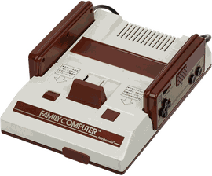<div class="y">1983</div><div class="n">ファミコン<span class="en block">Family Computer / NES</span></div></div>
<div class="pt">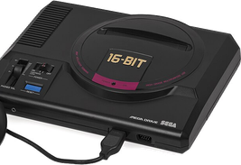<div class="y">1988</div><div class="n">メガドライブ<span class="en block">Mega Drive / Genesis</span></div></div>
<div class="pt">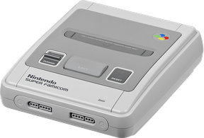<div class="y">1990</div><div class="n">スーパーファミコン<span class="en block">Super Famicom / SNES</span></div></div>
<div class="pt">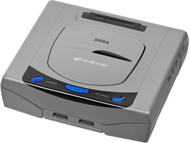<div class="y">1994</div><div class="n">セガサターン<span class="en block">Sega Saturn</span></div></div>
<div class="pt"><div class="y">1994</div><div class="n">プレイステーション<span class="en block">PlayStation</span></div></div>
<div class="pt"><div class="y">1998</div><div class="n">ドリームキャスト<span class="en block">Dreamcast</span></div></div>
<div class="pt"><div class="y">2000</div><div class="n">PlayStation 2</div></div>
<div class="pt"><div class="y">2006</div><div class="n">PlayStation 3</div></div>
<div class="pt"><div class="y">2017</div><div class="n">Nintendo Switch</div></div>
<div class="pt">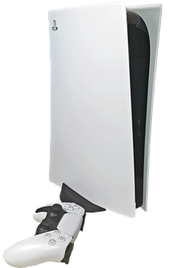<div class="y">2020</div><div class="n">PlayStation 5</div></div>
<div class="pt"><div class="y">2025</div><div class="n">Nintendo Switch 2</div></div>
</div>
</div>

<div class="erow">
<div class="ea">
<div class="hd"><span class="ic"><svg viewBox="0 0 24 24" fill="none" stroke="currentColor" stroke-width="1.308" stroke-linecap="round" stroke-linejoin="round"><rect x="3.15" y="3.15" width="7.24" height="7.24" rx="1.01"/><rect x="13.61" y="3.15" width="7.24" height="7.24" rx="1.01"/><rect x="3.15" y="13.61" width="7.24" height="7.24" rx="1.01"/><rect x="13.61" y="13.61" width="7.24" height="7.24" rx="1.01"/></svg></span><div class="tt">レトロ2D時代<span class="en block">The retro 2D era</span></div></div>
<p class="d">ドット絵・平面（従来のPyxel）<span class="en block">Pixel art, flat plane (Pyxel so far)</span></p>
<div class="shots">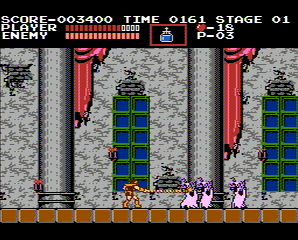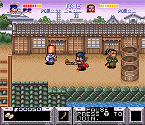</div>
<p class="gscr">悪魔城ドラキュラ &copy; 1986 KONAMI<br>がんばれゴエモン &copy; 1991 KONAMI</p>
</div>
<div class="ea">
<div class="hd"><span class="ic"><svg viewBox="0 0 24 24" fill="none" stroke="currentColor" stroke-width="1.308" stroke-linecap="round" stroke-linejoin="round"><path d="M12 2.77 20.44 7.46v9.09L12 21.22 3.56 16.54V7.46z"/><path d="M3.56 7.46 12 12.14l8.44-4.68M12 12.14v9.09"/></svg></span><div class="tt">レトロ3D時代<span class="en block">The retro 3D era</span></div></div>
<p class="d">ローポリゴン・立体空間<span class="en block">Low poly, 3D space</span></p>
<div class="shots">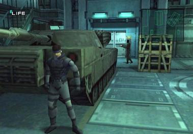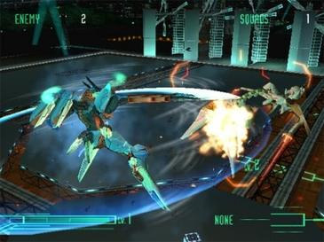</div>
<p class="gscr">METAL GEAR SOLID &copy; 1998 KONAMI<br>ZONE OF THE ENDERS &copy; 2001 KONAMI</p>
</div>
<div class="ar">→</div>
<div class="next">

<div class="nm">Pyxel Cube</div>
<div class="ver">Pyxel 3.0で追加される<br>レトロ3Dモジュール<span class="en block">A retro-3D module<br>added in Pyxel 3.0</span></div>
</div>
</div>
<p class="src">Console photos: Wikimedia Commons — PlayStation 5 by Gianlupisa1 (CC BY-SA 4.0), backgrounds removed</p>


---

<!-- _class: ch3 nodetree -->
# Pyxel Cubeの使い方
## How to Use Pyxel Cube

<p class="lead">ノードツリーで要素を配置。ノードの書き方は、2D版と同じ考え方 <span class="en block">Arrange things with the node tree. Writing a node follows the same idea as in 2D</span></p>

<div class="ntree">
<div class="tree">
<div class="th">ノードツリー<span class="en block">The node tree</span></div>
<div class="card">
<ul>
<li><span class="row"><span class="nd root">Scene</span><span class="note">場面全体<span class="en block">The whole scene</span></span></span>
<ul>
<li><span class="row"><span class="nd">Field</span><span class="note">マップ<span class="en block">The map</span></span></span></li>
<li><span class="row"><span class="nd">Player</span><span class="note">自機<span class="en block">Your ship</span></span></span>
<ul>
<li><span class="row"><span class="nd">Jet</span><span class="note">ジェットエフェクト（自機に追従）<span class="en block">The jet effect, follows the ship</span></span></span></li>
</ul>
</li>
<li><span class="row"><span class="nd">Enemy</span><span class="note">敵キャラクター<span class="en block">An enemy character</span></span></span>
<ul>
<li><span class="row"><span class="nd">Glare</span><span class="note">発光エフェクト（敵に追従）<span class="en block">The glow effect, follows the enemy</span></span></span></li>
</ul>
</li>
</ul>
</li>
</ul>
</div>
</div>
<div class="code">
<div class="th">Enemyノードの中身<span class="en block">Inside the Enemy node</span></div>

```python
from pyxel.cube import Node, Vec3

class Enemy(Node):
    def on_update(self):
        self.transform = self.transform.translate(
            Vec3(0.05, 0, 0))

    def on_draw(self):
        self.circ(Vec3.ZERO, 0.5, 11)
        self.text(Vec3(0, 0.8, 0), "enemy", 7)
```


</div>
</div>


---

<!-- _class: ch3 f2 cubedemo -->
# Pyxel Cube動作画面
## Pyxel Cube in Action

<div class="demos">
<figure>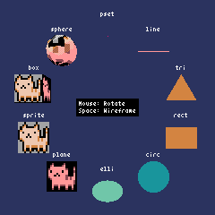</figure>
<figure>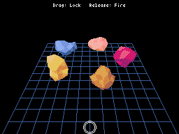</figure>
</div>

<p class="rel">近日公開予定<span class="en block">Coming soon</span></p>


---

<!-- _class: ch3 wrapup -->
# これからのPyxelは、もっと楽しい！
## Pyxel’s Future Is Even More Exciting!

<div class="wu">
<div class="grp">
<b>PyxelでAIがもっと身近に<span class="en block">AI feels closer with Pyxel</span></b>
<div class="a">AIは新しい仲間になれる<span class="en block">AI can be a new teammate</span></div>
<i class="ar"></i>
<div class="b">pyxel-mcpとpyxel-skillで<br>AIとPyxelが効率よく連携<span class="en block">pyxel-mcp and pyxel-skill let an AI<br>and Pyxel work together efficiently</span></div>
</div>

<div class="grp">
<b>Pyxelは「新しいレトロ」へ<span class="en block">Pyxel heads for a new kind of retro</span></b>
<div class="a">3Dのゲーム機も、レトロの領域に<span class="en block">3D consoles are entering retro territory too</span></div>
<i class="ar"></i>
<div class="b">Pyxel 3.0でPyxel Cubeを追加<br>2Dと同じ書き方で、3Dも作れる<span class="en block">Pyxel Cube arrives in Pyxel 3.0 —<br>written the same way as 2D, now in 3D</span></div>
</div>
<p class="concl">AI時代も、Pyxelで気軽に楽しくプログラミング！<span class="en block">Even in the age of AI, easy and fun programming with Pyxel!</span></p>
</div>


---

<!-- _class: section chclose -->
<p class="no chclosen"><span class="ic"><svg viewBox="0 0 24 24" fill="none" stroke="currentColor" stroke-width="1.308" stroke-linecap="round" stroke-linejoin="round"><path d="M7.04 19.34V2.68"/><path d="M7.04 3.67h14.29l-3.77 4.56 3.77 4.56H7.04z"/><path d="M2.68 21.32h8.73l-1.39-2.78h-5.95z"/></svg></span>CLOSING</p>

# おわりに
## In Closing

<p class="scene">


</p>


---

<!-- _class: closing chend -->
# 「楽しく作る」は、デザインできる
## The Fun of Making Can Be Designed

<p class="msg">これからも一緒に、PyxelとPythonで<br>プログラミングを遊んでいきましょう！<span class="en block">Let’s keep playing programming together — with Pyxel and Python!</span></p>

<p class="links">
<a class="x" href="https://x.com/kitao"><i></i><b>@kitao</b><em>Pyxel関連のニュースを発信しています<span class="en block">News around Pyxel</span></em></a>
<a class="gh" href="https://github.com/kitao/pyxel"><i></i><b>https://github.com/kitao/pyxel</b><em>スターをつけて応援よろしくお願いします！<span class="en block">A star would mean a lot</span></em></a>
</p>

